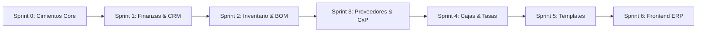

# ROADMAP.md — Hoja de Ruta Detallada de Ingeniería
## Empresarial SaaS (Payload CMS 3.x · Next.js 15 · Supabase)

> Este documento define las fases de desarrollo, contratos de datos, dependencias técnicas y estándares canónicos basados en la skill oficial de Payload CMS 3.x, las directivas de Context7 y la arquitectura consolidada de Cendaro ERP.

---

## 🧭 Visión del Producto
Transformar las capacidades probadas de **Cendaro ERP** en una plataforma modular gobernada por **Payload CMS 3.x**, montada sobre el **App Router de Next.js 15**, respaldada por el Transaction Pooler de **Supabase PostgreSQL** y con aislamiento multi-inquilino estricto a nivel de fila (`@payloadcms/plugin-multi-tenant`).

---

## 🏗️ Metodología de Ejecución (Bottom-Up Riguroso)

A diferencia del enfoque anterior (donde se codificaron 6 módulos de plugins de forma especulativa y sin una base de datos conectada), el desarrollo se ejecutará mediante **Sprints Atómicos**:

Cada sprint concluye con:
1. Una rama dedicada: `feat/sprint-X-nombre`.
2. Migración DDL en `src/migrations` ejecutada en Supabase.
3. Verificación de TypeScript (`tsc --noEmit`) y build local (`pnpm build`).
4. Despliegue en Vercel (Preview Environment) verificado y sin errores.
5. Merge limpio a `main`.

---

## 📦 Sprints de Implementación

### 🎯 Sprint 0: Cimientos Canónicos, Supabase, Vercel & Multi-Tenancy Base
> **Objetivo:** Establecer el proyecto Next.js 15 + Payload 3.x con conexión real a Supabase, pipeline de migraciones, autenticación multi-tenant y primer despliegue en Vercel.

- [ ] **Configuración del Entorno & Dependencias:**
  - `package.json` con dependencias oficiales: Next.js `15.x`, React `19.x`, Payload `3.x`, `@payloadcms/db-postgres`, `@payloadcms/plugin-multi-tenant`, `@payloadcms/richtext-lexical`, `sharp`.
  - `next.config.ts` envuelto canónicamente con `withPayload(nextConfig)`.
  - `tsconfig.json` configurado con alias `@/*` y `@payload-config`.
- [ ] **Persistencia & Conexión Supabase:**
  - `.env` configurado con Transaction Pooler (puerto 6543) y conexión directa para DDL (puerto 5432).
  - `src/payload.config.ts` con `@payloadcms/db-postgres`, `push: false`, `migrationDir: './src/migrations'`.
- [ ] **Colecciones Fundacionales:**
  - `Tenants`: Inquilinos con `name`, `slug` único y datos fiscales básicos.
  - `Users`: Autenticación nativa de Payload con campo `roles` (`super-admin`, `tenant-admin`, `operador`), relación a `tenants` y `saveToJWT: true`.
  - `Media`: Almacenamiento de archivos y comprobantes con aislamiento por tenant.
- [ ] **Plugin Multi-Tenant Base:**
  - Integración oficial de `@payloadcms/plugin-multi-tenant` configurado para `Media` y colecciones base.
  - Reglas de acceso estrictas: `super-admin` con acceso global; inquilinos restringidos a sus filas.
- [ ] **Rutas del Admin Panel (App Router):**
  - `src/app/(payload)/admin/[[...segments]]/page.tsx`
  - `src/app/(payload)/admin/[[...segments]]/not-found.tsx`
  - `src/app/(payload)/api/[...slug]/route.ts`
  - `src/app/(payload)/layout.tsx`
- [ ] **Pipeline de Migraciones:**
  - Generación de migración inicial `src/migrations/*_init_core.ts`.
  - Ejecución exitosa de la migración en Supabase PostgreSQL.
- [ ] **Despliegue & Validación en Vercel:**
  - Vinculación del repositorio con Vercel (`vercel link`).
  - Configuración de variables en Vercel y verificación de build en verde.
  - Acceso y registro del primer Super Admin en `/admin`.
- **Entregable:** PR `feat/sprint-0-core-infra-multitenant` mergeado a `main`.

---

### 💳 Sprint 1: Módulo Finanzas & CRM de Clientes (CxC Bimonetaria & WhatsApp)
> **Objetivo:** Cuentas por Cobrar (CxC), Facturación bimonetaria USD/VES y CRM de clientes con cálculo transaccional atómico y cobranza por WhatsApp.

- [ ] **Colección `Customers`:**
  - RIF/Cédula, Razón social, Teléfono validado internacionalmente para WhatsApp, Dirección fiscal.
  - Segmentación CRM: `'lead' | 'first_time' | 'recurring' | 'vip' | 'inactive'`.
  - Reglas de Crédito: `creditAllowed`, `creditLimitUSD`, `creditDays`.
  - Balances de Ledger: `currentDebtUSD`, `currentDebtVES`, `overdueDebtUSD`.
  - Campos Virtuales de Envejecimiento de Deuda (`aging0to30`, `aging31to60`, `aging60Plus`).
- [ ] **Colección `Invoices`:**
  - Facturas y notas de entrega bimonetarias con snapshot de tasa de cambio al emitir (`exchangeRateSnapshot`).
  - Relación a `Customers`, fecha de vencimiento (`dueDate`), condición (`cash`/`credit`).
  - Totales bimonetarios: `totalUSD`, `totalVES`, `balanceUSD`, `balanceVES`.
  - Array de líneas de detalle (SKU, descripción, cantidad, precio unitario, subtotal).
- [ ] **Colección `CustomerPayments`:**
  - Abonos con métodos múltiples (`cash_usd`, `cash_ves`, `zelle`, `pago_movil`, `transfer_ves`, `binance`).
  - Asignación específica por factura (`allocations`) y comprobante adjunto (`Media`).
- [ ] **Hooks de Ledger Transaccional:**
  - Recalculación atómica en `afterChange` y reversión en `beforeDelete` pasando `{ req }`.
  - Prevención de recursión con `req.context.skipBalanceRecalculation`.
- [ ] **Generador de Cobranza WhatsApp:**
  - Endpoint de estado de cuenta consolidado con deep-link directo a WhatsApp (`https://wa.me/...`).
- [ ] **Migración DDL & Validación:** Migración `add_finance_crm` aplicada y verificada en `/admin`.
- **Entregable:** PR `feat/sprint-1-finance-crm` mergeado a `main`.

---

### 📦 Sprint 2: Módulo Inventario, Almacenes y Producción / BOM
> **Objetivo:** Catálogo de productos, control de stock multi-almacén y órdenes de fabricación con consumo de recetas (BOM).

- [ ] **Colección `Categories` & `Warehouses`:** Clasificación y depósitos físicos/virtuales por tenant.
- [ ] **Colección `Products`:** Artículos simples y manufacturados (`standard` / `manufactured`), control de stock mínimo, costos ponderados y precios de venta.
- [ ] **Colección `StockMovements`:** Trazabilidad inmutable de entradas, salidas, transferencias y ajustes de inventario.
- [ ] **Colección `BillOfMaterials` (Fórmulas/Recetas):** Estructura de insumos requeridos por unidad de producto terminado, cálculo de mermas y costos indirectos de fabricación.
- [ ] **Colección `ProductionOrders`:** Órdenes de fabricación con estados (`draft`, `planned`, `in_progress`, `completed`).
- [ ] **Hooks Transaccionales de Producción:**
  - Al completar la orden: descuento atómico de materias primas e ingreso de producto terminado en la misma transacción de PostgreSQL.
- [ ] **Migración DDL & Validación:** Migración `add_inventory_bom` aplicada y verificada.
- **Entregable:** PR `feat/sprint-2-inventory-bom` mergeado a `main`.

---

### 🏢 Sprint 3: Módulo Proveedores & Cuentas por Pagar (CxP)
> **Objetivo:** Registro de compras a proveedores, control de deuda comercial y recepción atómica de inventario.

- [ ] **Colección `Suppliers`:** Padrón de proveedores con condiciones de crédito y balance de deuda deudor.
- [ ] **Colección `PurchaseInvoices`:** Facturas de compras con vencimiento y registro de recepción de mercancía.
- [ ] **Colección `SupplierPayments`:** Comprobantes de egreso con asignación a facturas de compra.
- [ ] **Hooks de Conciliación de Compras:** Actualización del balance del proveedor y creación automática de movimientos de inventario (`StockMovements`) al recepcionar compras.
- [ ] **Migración DDL & Validación:** Migración `add_accounts_payable` aplicada y verificada.
- **Entregable:** PR `feat/sprint-3-accounts-payable` mergeado a `main`.

---

### 💵 Sprint 4: Módulo Cajas Registradoras, Cierre de Turno y Tasas Cambiarias
> **Objetivo:** Gestión de puntos de venta físicos, arqueo ciego multimétodo y servicio en vivo de tasas de cambio (BCV / Paralelo).

- [ ] **Colección `CashRegisters`:** Cajas registradoras asignadas a sucursales y usuarios.
- [ ] **Colección `CashClosures`:** Sesiones de turno con balance de apertura, recaudación por método (Efectivo USD/Bs, Punto, Pago Móvil, Zelle), conteo ciego de cierre y cálculo de sobrante/faltante.
- [ ] **Servicio de Tasas Cambiarias:**
  - Consulta automatizada de tasa oficial BCV y Binance P2P con cache serverless (revalidate: 120s).
- [ ] **Migración DDL & Validación:** Migración `add_cash_registers` aplicada y verificada.
- **Entregable:** PR `feat/sprint-4-cash-registers` mergeado a `main`.

---

### 🏭 Sprint 5: Motor de Plantillas Industriales & Onboarding Atómico
> **Objetivo:** Wizard de inicialización por industria (Alimentos/Panadería, Farmacia/Retail, Mayorista B2B) que auto-puebla catálogos, recetas y almacenes en un clic.

- [ ] **Colección `IndustryTemplates`:** Definiciones declarativas de industrias con sus categorías, productos base, fórmulas BOM y métodos de pago sugeridos.
- [ ] **Seeder Atómico con Payload Jobs:** Carga de datos iniciales encolada para ejecución segura en entornos serverless sin sobrepasar el timeout de Next.js.
- [ ] **Migración DDL & Validación:** Migración `add_industry_templates` aplicada y verificada.
- **Entregable:** PR `feat/sprint-5-industry-templates` mergeado a `main`.

---

### 🖥️ Sprint 6: Frontend Operativo Cendaro ERP (App Shell Next.js 15)
> **Objetivo:** Interfaz de usuario de alta densidad montada sobre el App Router de Next.js 15, consumiendo la Payload Local API con latencia cero.

- [ ] **Ruta Dinámica Tenant:** `src/app/(app)/[tenant]/erp/`.
- [ ] **Componentes de App Shell:** Sidebar colapsable modular, Header interactivo con ticker de tasa BCV en vivo y selector de tenant.
- [ ] **Dashboard Ejecutivo de Finanzas:** Tarjetas KPI de liquidez, cuentas por cobrar, cuentas por pagar y flujo de caja en tiempo real.
- [ ] **Data Grids de Alta Eficiencia:** Tablas virtuales con `@tanstack/react-table` y filtros de búsqueda instantáneos.
- [ ] **Despliegue Final & Pruebas E2E:** Verificación de rendimiento en Vercel con Core Web Vitals optimizados.
- **Entregable:** PR `feat/sprint-6-cendaro-ui` mergeado a `main`.

---

## 🔒 Estándares No Negociables de Calidad y Seguridad
- **Cero `any`:** Código estrictamente tipado contra `payload-types.ts`.
- **Transacciones Atómicas:** `req` propagado en cada mutación interna de hooks.
- **Aislamiento Multi-Tenant Blindado:** Filtrado automático por `tenant` en todas las consultas y mutaciones.
- **Validación Zod:** Contratos de entrada validados en cada endpoint y Server Action.
