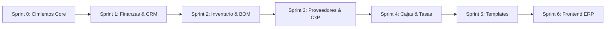

# ROADMAP.md — Hoja de Ruta Detallada de Ingeniería
## Empresarial SaaS (Payload CMS 3.x · Next.js 15 · Supabase)

> Este documento define las fases de desarrollo, contratos de datos, dependencias técnicas y estándares canónicos basados en la skill oficial de Payload CMS 3.x, las directivas de Context7 y la arquitectura consolidada de Cendaro ERP.

---

## 🧭 Visión del Producto
Transformar las capacidades probadas de **Cendaro ERP** en una plataforma modular gobernada por **Payload CMS 3.x**, montada sobre el **App Router de Next.js 15**, respaldada por el Transaction Pooler de **Supabase PostgreSQL** y con aislamiento multi-inquilino estricto a nivel de fila (`@payloadcms/plugin-multi-tenant`).

---

## 🏗️ Metodología de Ejecución (Bottom-Up Riguroso)

A diferencia del enfoque anterior (donde se codificaron 6 módulos de plugins de forma especulativa y sin una base de datos conectada), el desarrollo se ejecutará mediante **Sprints Atómicos**:

Cada sprint concluye con:
1. Una rama dedicada: `feat/sprint-X-nombre`.
2. Migración DDL en `src/migrations` ejecutada en Supabase.
3. Verificación de TypeScript (`tsc --noEmit`) y build local (`pnpm build`).
4. Despliegue en Vercel (Preview Environment) verificado y sin errores.
5. Merge limpio a `main`.

---

## 📦 Sprints de Implementación

### 🎯 Sprint 0: Cimientos Canónicos, Supabase, Vercel & Multi-Tenancy Base
> **Objetivo:** Establecer el proyecto Next.js 15 + Payload 3.x con conexión real a Supabase, pipeline de migraciones, autenticación multi-tenant y primer despliegue en Vercel.

- [x] **Configuración del Entorno & Dependencias:**
  - `package.json` con dependencias oficiales: Next.js `15.x`, React `19.x`, Payload `3.x`, `@payloadcms/db-postgres`, `@payloadcms/plugin-multi-tenant`, `@payloadcms/richtext-lexical`, `sharp`.
  - `next.config.ts` envuelto canónicamente con `withPayload(nextConfig)`.
  - `tsconfig.json` configurado con alias `@/*` y `@payload-config`.
- [x] **Persistencia & Conexión Supabase:**
  - `.env` configurado con Transaction Pooler (puerto 6543) y conexión directa para DDL (puerto 5432).
  - `src/payload.config.ts` con `@payloadcms/db-postgres`, `push: false`, `migrationDir: './src/migrations'`.
- [x] **Colecciones Fundacionales:**
  - `Tenants`: Inquilinos con `name`, `slug` único y datos fiscales básicos.
  - `Users`: Autenticación nativa de Payload con campo `roles` (`super-admin`, `tenant-admin`, `operador`), relación a `tenants` y `saveToJWT: true`.
  - `Media`: Almacenamiento de archivos y comprobantes con aislamiento por tenant.
- [x] **Plugin Multi-Tenant Base:**
  - Integración oficial de `@payloadcms/plugin-multi-tenant` configurado para `Media` y colecciones base.
  - Reglas de acceso estrictas: `super-admin` con acceso global; inquilinos restringidos a sus filas.
- [x] **Rutas del Admin Panel (App Router):**
  - `src/app/(payload)/admin/[[...segments]]/page.tsx`
  - `src/app/(payload)/admin/[[...segments]]/not-found.tsx`
  - `src/app/(payload)/api/[...slug]/route.ts`
  - `src/app/(payload)/layout.tsx`
- [x] **Pipeline de Migraciones:**
  - Generación de migración inicial `src/migrations/*_init_core.ts`.
  - Ejecución exitosa de la migración en Supabase PostgreSQL.
- [x] **Despliegue & Validación en Vercel:**
  - Vinculación del repositorio con Vercel (`vercel link`).
  - Configuración de variables en Vercel y verificación de build en verde.
  - Acceso verificado a producción: `https://empresarial-saas.vercel.app/admin`.
- **Estado:** ✅ **Sprint 0 Concluido al 100%** (Listo para merge a `main`).

---

### 💳 Sprint 1: Módulo Finanzas & CRM de Clientes (CxC Bimonetaria & WhatsApp)
> **Objetivo:** Cuentas por Cobrar (CxC), Facturación bimonetaria USD/VES y CRM de clientes con cálculo transaccional atómico y cobranza por WhatsApp.

- [x] **Colección `Customers`:**
  - RIF/Cédula, Razón social, Teléfono validado internacionalmente para WhatsApp, Dirección fiscal.
  - Segmentación CRM: `'lead' | 'first_time' | 'recurring' | 'vip' | 'inactive'`.
  - Reglas de Crédito: `creditAllowed`, `creditLimitUSD`, `creditDays`.
  - Balances de Ledger: `currentDebtUSD`, `currentDebtVES`, `overdueDebtUSD`.
  - Campos Virtuales de Envejecimiento de Deuda (`aging0to30`, `aging31to60`, `aging60Plus`).
- [x] **Colección `Invoices`:**
  - Facturas y notas de entrega bimonetarias con snapshot de tasa de cambio al emitir (`exchangeRateSnapshot`).
  - Relación a `Customers`, fecha de vencimiento (`dueDate`), condición (`cash`/`credit`).
  - Totales bimonetarios: `totalUSD`, `totalVES`, `balanceUSD`, `balanceVES`.
  - Array de líneas de detalle (SKU, descripción, cantidad, precio unitario, subtotal).
- [x] **Colección `CustomerPayments`:**
  - Abonos con métodos múltiples (`cash_usd`, `cash_ves`, `zelle`, `pago_movil`, `transfer_ves`, `binance`).
  - Asignación específica por factura (`allocations`) y comprobante adjunto (`Media`).
- [x] **Hooks de Ledger Transaccional:**
  - Recalculación atómica en `afterChange` y reversión en `beforeDelete` pasando `{ req }`.
  - Prevención de recursión con `req.context.skipBalanceRecalculation`.
- [x] **Generador de Cobranza WhatsApp:**
  - Endpoint de estado de cuenta consolidado (`/api/customers/:id/statement`) y campo virtual `whatsappDebtUrl` con deep-link directo a WhatsApp (`https://wa.me/...`).
- [x] **Migración DDL & Validación:** Migración `add_finance_crm` (`20260904_190009_add_finance_crm.ts`) aplicada y verificada en Supabase PostgreSQL.
- **Estado:** ✅ **Sprint 1 Concluido al 100%** (Listo para PR y merge a `main`).

---

### 📦 Sprint 2: Módulo Inventario, Almacenes y Producción / BOM
> **Objetivo:** Catálogo de productos, control de stock multi-almacén y órdenes de fabricación con consumo de recetas (BOM).

- [x] **Colección `Categories` & `Warehouses`:** Clasificación y depósitos físicos/virtuales por tenant.
- [x] **Colección `Products`:** Artículos simples y manufacturados (`standard` / `manufactured`), control de stock mínimo, costos ponderados y precios de venta.
- [x] **Colección `StockMovements`:** Trazabilidad inmutable de entradas, salidas, transferencias y ajustes de inventario.
- [x] **Colección `BillOfMaterials` (Fórmulas/Recetas):** Estructura de insumos requeridos por unidad de producto terminado, cálculo de mermas y costos indirectos de fabricación.
- [x] **Colección `ProductionOrders`:** Órdenes de fabricación con estados (`draft`, `planned`, `in_progress`, `completed`).
- [x] **Hooks Transaccionales de Producción:**
  - Al completar la orden: descuento atómico de materias primas e ingreso de producto terminado en la misma transacción de PostgreSQL.
- [x] **Migración DDL & Validación:** Migración `add_inventory_bom` (`20260904_195815_add_inventory_bom.ts`) aplicada y verificada en Supabase PostgreSQL.
- **Estado:** ✅ **Sprint 2 Concluido al 100%** (Listo para PR y merge a `main`).

---

### 🏢 Sprint 3: Módulo Proveedores & Cuentas por Pagar (CxP)
> **Objetivo:** Registro de compras a proveedores, control de deuda comercial y recepción atómica de inventario.

- [x] **Colección `Suppliers`:** Padrón de proveedores con condiciones de crédito y balance de deuda deudor.
- [x] **Colección `PurchaseInvoices`:** Facturas de compras con vencimiento y registro de recepción de mercancía.
- [x] **Colección `SupplierPayments`:** Comprobantes de egreso con asignación a facturas de compra.
- [x] **Hooks de Conciliación de Compras:** Actualización del balance del proveedor y creación automática de movimientos de inventario (`StockMovements`) al recepcionar compras.
- [x] **Migración DDL & Validación:** Migración `add_accounts_payable` (`20260904_221053_add_accounts_payable.ts`) aplicada y verificada en Supabase PostgreSQL.
- **Estado:** ✅ **Sprint 3 Concluido al 100%** (Listo para PR y merge a `main`).

---

### 💵 Sprint 4: Módulo Cajas Registradoras, Cierre de Turno y Tasas Cambiarias
> **Objetivo:** Gestión de puntos de venta físicos, arqueo ciego multimétodo y servicio en vivo de tasas de cambio (BCV / Paralelo).

- [x] **Colección `CashRegisters`:** Cajas registradoras asignadas a sucursales y usuarios con aislamiento multi-tenant y estado operativo automático.
- [x] **Colección `CashClosures`:** Sesiones de turno con balance de apertura, recaudación por método (Efectivo USD/Bs, Punto, Pago Móvil, Zelle, Binance), arqueo ciego multimétodo y cálculo automático de sobrante/faltante en hook transaccional.
- [x] **Servicio de Tasas Cambiarias:**
  - Endpoint (`/api/exchange-rates`) y utilidad serverless (`src/utilities/exchangeRate.ts`) con cache optimizada (TTL: 120s) para consultar la tasa oficial BCV, Binance P2P y Dólar Paralelo con resolución jerárquica por tenant.
- [x] **Migración DDL & Validación:** Migración `add_cash_registers` (`20260904_224151_add_cash_registers.ts`) aplicada y verificada en Supabase PostgreSQL.
- **Estado:** ✅ **Sprint 4 Concluido al 100%** (Listo para PR y merge a `main`).

---

### 🏭 Sprint 5: Motor de Plantillas Industriales & Onboarding Atómico
> **Objetivo:** Wizard de inicialización por industria (Alimentos/Panadería, Farmacia/Retail, Mayorista B2B) que auto-puebla catálogos, recetas y almacenes en un clic.

- [x] **Colección `IndustryTemplates`:** Definiciones declarativas de industrias con sus categorías, productos base, fórmulas BOM y métodos de pago sugeridos.
- [x] **Seeder Atómico con Payload Jobs:** Carga de datos iniciales encolada para ejecución segura en entornos serverless sin sobrepasar el timeout de Next.js (`seedIndustryTemplate` task y fallback síncrono).
- [x] **Migración DDL & Validación:** Migración `add_industry_templates` (`20260904_225525_add_industry_templates.ts`) aplicada y verificada en Supabase PostgreSQL.
- **Estado:** ✅ **Sprint 5 Concluido al 100%** (Listo para PR y merge a `main`).

---

### 🖥️ Sprint 6: Frontend Operativo Cendaro ERP (App Shell Next.js 15)
> **Objetivo:** Interfaz de usuario de alta densidad montada sobre el App Router de Next.js 15, consumiendo la Payload Local API con latencia cero.

- [x] **Ruta Dinámica Tenant:** `src/app/(app)/[tenant]/erp/` (con layout asíncrono para `params` de Next.js 15).
- [x] **Componentes de App Shell:** Sidebar colapsable modular, Header interactivo con ticker de tasa BCV en vivo (`CurrencyTicker`) y selector dinámico de empresas.
- [x] **Dashboard Ejecutivo de Finanzas:** Tarjetas KPI de liquidez, cuentas por cobrar (CxC), cuentas por pagar (CxP), estado de cajas y stock crítico, consumiendo la Payload Local API con cero latencia de red.
- [x] **Data Grids de Alta Eficiencia:** Vistas operativas de Clientes con deep links de cobranza por WhatsApp, Inventario y Recetas BOM, Puntos de Venta y Proveedores.
- [x] **Motor de Plantillas en UI:** Catálogo visual interactivo de plantillas industriales con botón de siembra directa por tenant (`TemplateApplyButton`).
- **Estado:** ✅ **Sprint 6 Concluido al 100%** (Listo para PR y entrega).

---

# 🚀 FASE 3 — Cierre del Ciclo de Negocio (Paridad Completa con Cendaro)

> **Resultado del análisis comparativo con el repo de referencia Cendaro** (`jesusjosezapata99-jpg/Cendaro`, excluyendo MercadoLibre y WhatsApp). El núcleo contable de esta plataforma es superior (CxP real, caja multimétodo, BOM, bimoneda por documento), pero faltan el cableado venta→inventario, el ciclo de caja completo, la importación masiva y las capas de gobernanza. Cada sprint concluye con el protocolo estándar: rama `feat/sprint-X-nombre` → migraciones (`migrate:create`) → `tsc --noEmit` + lint + build → PR → merge.

## 🧭 Decisión de Arquitectura (no renegociable)
1. **Continuamos con colecciones canónicas** (`src/collections/*` + `src/utilities/*` + `src/actions/*` registradas en `payload.config.ts`). Los plugins custom estilo `src/plugins/erp/` quedan **prohibidos** (fue el error de la Fase abandonada). Los hooks de extensión se componen en arrays, nunca se sobrescriben.
2. **Plugin oficial `@payloadcms/plugin-import-export`** (fuera de beta desde Payload 3.85.0; nosotros en 3.88.0) SOLO para importar/exportar **catálogos** (products, customers, categories, suppliers) con `matchField` (sku/taxId/code). **NUNCA para stock**: `currentStock` es inmutable y el Kardex (`StockMovements`) es la única vía de alterar existencias, por lo que la carga masiva de inventario es una Server Action propia que crea movimientos dentro de una transacción.
3. **Serverless**: el plugin usa Jobs Queue; como Vercel no tiene runner de cron, se configura `disableJobsQueue: true` + `importLimit`/`exportLimit` acotados.
4. Toda mutación nueva hereda el estándar de los sprints 5-6: Zod, `overrideAccess: false` + usuario, transacciones con `req`, context flags contra recursión, numeración con `pg_advisory_xact_lock`.

---

### 📦 Sprint 7: Integridad del Kardex — Venta → Inventario (y Devoluciones)
> **Objetivo:** Que vender consuma existencias y anular/devolver las reponga, cerrando la única brecha de integridad contable del sistema.

- [ ] **Utilidad `src/utilities/salesLedger.ts`:**
  - `applySaleStockDeduction({ invoice, req })`: por cada línea con `product` (y `trackInventory`), resolver almacén (`invoice.warehouse` si existe, si no el almacén activo `isDefault` del tenant) y crear movimientos `sale_out` (`sourceWarehouse`, campo `invoice`, `unitCostUSD` = `costUSD` del producto como snapshot). Idempotencia por consulta de movimientos existentes con ese `invoice.id` (mismo patrón que `purchasesLedger` con `purchase_invoice_id`). Validación multi-tenant de producto/almacén. Recalcular `currentStock` con `recalculateProductTotalStock` y context flags.
  - `revertSaleFromInventory({ invoice, req, lines? })`: crea movimientos `sale_return` (nuevo tipo) por las líneas a reponer y recalcula.
- [ ] **Wiring en `src/collections/Invoices/index.ts`:** en `afterChangeInvoice` (componiendo, no sustituyendo) invocar la deducción al crear factura (status `issued`/`paid`); en `beforeDelete`/anulación (`voided`) invocar la reversión. Flags: `req.context.skipStockRecalculation` + verificación de idempotencia para no deduplicar en updates.
- [ ] **Migración:** `migrate:create add_sale_return` (nueva opción en el enum `movementType` → `ALTER TYPE ... ADD VALUE 'sale_return'`).
- [ ] **Validación:** venta de contado → kardex `sale_out` + `currentStock` baja; anulación → `sale_return` + reposición; factura sin productos físicos → sin movimientos.
- **Entregable:** PR `feat/sprint-7-sales-inventory`.

---

### 💵 Sprint 8: Ciclo de Caja Completo + Punto de Venta (POS)
> **Objetivo:** Operar un turno de caja de punta a punta: apertura con fondo inicial, venta de mostrador y cierre ciego (ya existente).

- [ ] **`openCashShiftAction`** en `src/actions/erpActions.ts`: valida que la caja pertenezca al tenant y esté activa; reutiliza `assertNoOpenShiftForRegister` (ya existe en `cashLedger.ts`); crea `cash-closures` con `status: 'open'`, `openingFloat { cashUSD, cashVES, notes }`, `openedBy` (usuario autenticado), `openedAt`. Zod + `requireErpTenantAccess` + transacción. El hook `afterChangeCashClosure` ya sincroniza el estado de la caja.
- [ ] **UI de apertura:** `src/components/erp/modals/OpenShiftModal.tsx` (fondo inicial USD/Bs) + botón "Abrir Turno" / indicador de turno abierto en `CashRegistersView`.
- [ ] **Punto de Venta:** ruta `src/app/(app)/[tenant]/erp/pos/page.tsx` (guard de acceso estándar) + vista cliente: typeahead de productos, carrito con cantidades/precios (consumiendo `priceTiers` del Sprint 11 si existe), cliente de mostrador auto-creado (RIF `V-00000000`, idempotente), método de cobro, caja preseleccionada (turno abierto del cajero) y opción de crédito (valida `creditAllowed`/`creditLimitUSD`). Todo consume `createInvoiceAction` existente (ya soporta `cashMethod` + `cashRegisterId`).
- [ ] **Navegación:** entrada "Punto de Venta" en el sidebar con icono Lucide.
- **Entregable:** PR `feat/sprint-8-cash-cycle-pos`.

---

### 📥 Sprint 9: Importación Excel — Catálogo (Plugin Oficial) e Inventario (Kardex)
> **Objetivo:** Onboarding de datos masivo. Catálogo vía el plugin oficial; inventario vía Server Action propia porque el Kardex es inmutable.

- [ ] **Instalar `@payloadcms/plugin-import-export`** y configurar en `payload.config.ts`: colecciones `products` (match `sku`), `customers` (match `taxId`), `categories` (match `code`), `suppliers` (match `taxId`), modo `upsert`; `disableJobsQueue: true`; `importLimit`/`exportLimit` acotados (~2000); `overrideImportCollection`/`overrideExportCollection` con acceso restringido (`super-admin`/`tenant-admin`) + `admin.group: 'Administración'` (advertencia de seguridad del plugin: los archivos exportados heredan datos legibles). Defaults de campos (productType, unitOfMeasure, taxRate) vía field-level hooks `custom['plugin-import-export']`. El tenant se asigna solo: los hooks `beforeValidate` existentes resuelven el tenant desde `req.user`.
- [ ] **Carga masiva de inventario (kardex-puro):** Server Action `importStockAction(tenantId, warehouseId, mode: 'adjust' | 'set', rows[{sku, quantity}])` → transacción única: resolver producto por sku+tenant, calcular delta, crear `StockMovements` (`adjustment_positive`/`adjustment_negative`), rechazar saldos negativos, recalcular `currentStock`. Registrar en `audit-log` (Sprint 12 si ya existe).
- [ ] **UI:** ruta `src/app/(app)/[tenant]/erp/inventory/import/page.tsx` — subir CSV/XLSX (parseo cliente con `xlsx`), vista previa con validación por fila, resultados con errores descargables. Botón de exportar catálogo actual como plantilla.
- **Entregable:** PR `feat/sprint-9-excel-import`.

---

### 🧾 Sprint 10: Cotizaciones, Pedidos y Devoluciones
> **Objetivo:** Vender sin facturar (cotización → factura) y manejar devoluciones de mercancía.

- [ ] **Colección `quotes`:** `quoteNumber` (numeración con lock), customer, items (product, description, quantity, unitPriceUSD, discount), totales bimonetarios con `exchangeRateSnapshot`, `validUntil`, `status` (`draft/sent/accepted/rejected/expired/converted`), `convertedInvoice`. Hook `beforeValidate` recalcula totales (patrón BOM).
- [ ] **`convertQuoteToInvoiceAction`:** transaccional — crea la factura (heredando líneas y cliente, con `paymentTerms` elegido en la conversión), marca la cotización `converted` + `convertedInvoice`. Condición de crédito valida `creditAllowed`/`creditLimitUSD`.
- [ ] **Devoluciones:** Server Action `createSaleReturnAction(invoiceId, lines[{product, quantity}], warehouseId, restock)` → movimientos `sale_return` (enum del Sprint 7) transaccionales + recálculo de stock; registro con `reason`. Botón "Registrar Devolución" en la vista de factura.
- [ ] **UI:** vista `src/app/(app)/[tenant]/erp/quotes/` (lista + modal de creación + botón convertir); `quoteNumber`/`status` en sidebar del grupo Finanzas.
- [ ] **Migración:** `migrate:create add_quotes`.
- **Entregable:** PR `feat/sprint-10-quotes-returns`.

---

### 🏷️ Sprint 11: Motor de Precios Bimonetario + Vendedores
> **Objetivo:** Listas de precios por segmento, historial de cambios y canal de vendedores con comisiones.

- [ ] **Listas de precios:** array `priceTiers` en Products (`tier: retail | wholesale | vendor | promo`, `priceUSD`) con validación de unicidad por tier; POS/facturas seleccionan tier según `customer.type`. `priceUSD` actual queda como `retail`.
- [ ] **Colección `price-history`:** product, oldPriceUSD/newPriceUSD, rate snapshot, priceVES resultante, `trigger` (`manual | rate_change`), changedBy. Hook `beforeChange` en Products escribe el historial cuando cambia `priceUSD`.
- [ ] **Repricing por tasa:** endpoint `POST /api/pricing/apply-rate` (super-admin/tenant-admin) que recalcula precios VES sugeridos y emite evento de revisión; **sin** auto-aplicación masiva en v1 (decisión documentada: el margen se fija en USD y VES es derivado).
- [ ] **Vendedores:** nuevo rol `vendor` en `Users` (migración del enum de roles + matriz RBAC de `erpAuth`/colecciones), `assignedVendor` + `commissionPct` en Customers; vista `/erp/vendors` (rol vendor: sus clientes, facturas y comisiones acumuladas calculadas por query; tenant-admin: todas). Las comisiones se derivan de facturas pagadas — sin colección extra en v1.
- [ ] **Migraciones:** `migrate:create add_pricing_vendors` (enum roles + columnas).
- **Entregable:** PR `feat/sprint-11-pricing-vendors` (split 11a precios / 11b vendedores si el PR crece demasiado).

---

### 🛡️ Sprint 12: Gobernanza — Auditoría, Cuotas y Conteos Cíclicos
> **Objetivo:** Trazabilidad empresarial (audit trail), planes de pago por cuotas y conteos físicos de inventario.

- [ ] **Auditoría:** colección `audit-log` (actor, rol, colección, docId, operación, diff de campos, metadata, correlationId) + factory `src/hooks/audit.ts` `withAudit(slug)` que compone `afterChange`/`afterDelete` **preservando los hooks existentes** (patrón de la constitución) y propaga `req` (misma transacción). Activar en: invoices, customer-payments, purchase-invoices, supplier-payments, products, cash-closures, quotes, tenants. Vista de lectura en admin (grupo Administración, `tenant-admin`+).
- [ ] **Cuotas (installments):** array `installments` en Invoices `[{ number, dueDate, amountUSD, status, paidUSD }]` — generado automáticamente al emitir a crédito (según `creditDays`) o editable; los allocations de `customer-payments` marcan cuotas pagadas en orden de vencimiento (hook transaccional); el aging pasa a usar la cuota más antigua impaga.
- [ ] **Conteos cíclicos:** colección `inventory-counts` (warehouse, `status: draft/in_progress/completed`, items con `systemQty` snapshot / `countedQty` / `difference`); flujo UI de 3 pasos (crear → contar → completar); al completar, Server Action transaccional genera movimientos `adjustment_positive`/`adjustment_negative` por kardex y deja registro de discrepancia.
- [ ] **Migraciones:** `migrate:create add_governance`.
- **Entregable:** PR `feat/sprint-12-governance`.

---

### ✅ Criterios de Cierre de la Fase 3
1. Vender/desarrollar/anular mueve el kardex de forma idempotente y multi-tenant.
2. Un cajero opera su jornada completa (abrir → vender en POS → arqueo ciego) sin tocar el admin.
3. Un cliente nuevo importa su catálogo e inventario inicial por Excel en < 30 minutos.
4. Toda mutación financiera queda auditada con actor y diff.
5. Paridad funcional con Cendaro (excluyendo MercadoLibre y WhatsApp) verificada contra esta lista.

---

## 🔒 Estándares No Negociables de Calidad y Seguridad
- **Cero `any`:** Código estrictamente tipado contra `payload-types.ts`.
- **Transacciones Atómicas:** `req` propagado en cada mutación interna de hooks.
- **Aislamiento Multi-Tenant Blindado:** Filtrado automático por `tenant` en todas las consultas y mutaciones.
- **Validación Zod:** Contratos de entrada validados en cada endpoint y Server Action.
