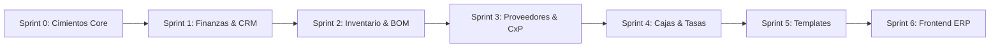

# ROADMAP.md — Hoja de Ruta Detallada de Ingeniería
## Empresarial SaaS (Payload CMS 3.x · Next.js 15 · Supabase)

> Este documento define las fases de desarrollo, contratos de datos, dependencias técnicas y estándares canónicos basados en la skill oficial de Payload CMS 3.x, las directivas de Context7 y la arquitectura consolidada de Cendaro ERP.

---

## 🧭 Visión del Producto
Transformar las capacidades probadas de **Cendaro ERP** en una plataforma modular gobernada por **Payload CMS 3.x**, montada sobre el **App Router de Next.js 15**, respaldada por el Transaction Pooler de **Supabase PostgreSQL** y con aislamiento multi-inquilino estricto a nivel de fila (`@payloadcms/plugin-multi-tenant`).

---

## 🏗️ Metodología de Ejecución (Bottom-Up Riguroso)

A diferencia del enfoque anterior (donde se codificaron 6 módulos de plugins de forma especulativa y sin una base de datos conectada), el desarrollo se ejecutará mediante **Sprints Atómicos**:

Cada sprint concluye con:
1. Una rama dedicada: `feat/sprint-X-nombre`.
2. Migración DDL en `src/migrations` ejecutada en Supabase.
3. Verificación de TypeScript (`tsc --noEmit`) y build local (`pnpm build`).
4. Despliegue en Vercel (Preview Environment) verificado y sin errores.
5. Merge limpio a `main`.

---

## 📦 Sprints de Implementación

### 🎯 Sprint 0: Cimientos Canónicos, Supabase, Vercel & Multi-Tenancy Base
> **Objetivo:** Establecer el proyecto Next.js 15 + Payload 3.x con conexión real a Supabase, pipeline de migraciones, autenticación multi-tenant y primer despliegue en Vercel.

- [x] **Configuración del Entorno & Dependencias:**
  - `package.json` con dependencias oficiales: Next.js `15.x`, React `19.x`, Payload `3.x`, `@payloadcms/db-postgres`, `@payloadcms/plugin-multi-tenant`, `@payloadcms/richtext-lexical`, `sharp`.
  - `next.config.ts` envuelto canónicamente con `withPayload(nextConfig)`.
  - `tsconfig.json` configurado con alias `@/*` y `@payload-config`.
- [x] **Persistencia & Conexión Supabase:**
  - `.env` configurado con Transaction Pooler (puerto 6543) y conexión directa para DDL (puerto 5432).
  - `src/payload.config.ts` con `@payloadcms/db-postgres`, `push: false`, `migrationDir: './src/migrations'`.
- [x] **Colecciones Fundacionales:**
  - `Tenants`: Inquilinos con `name`, `slug` único y datos fiscales básicos.
  - `Users`: Autenticación nativa de Payload con campo `roles` (`super-admin`, `tenant-admin`, `operador`), relación a `tenants` y `saveToJWT: true`.
  - `Media`: Almacenamiento de archivos y comprobantes con aislamiento por tenant.
- [x] **Plugin Multi-Tenant Base:**
  - Integración oficial de `@payloadcms/plugin-multi-tenant` configurado para `Media` y colecciones base.
  - Reglas de acceso estrictas: `super-admin` con acceso global; inquilinos restringidos a sus filas.
- [x] **Rutas del Admin Panel (App Router):**
  - `src/app/(payload)/admin/[[...segments]]/page.tsx`
  - `src/app/(payload)/admin/[[...segments]]/not-found.tsx`
  - `src/app/(payload)/api/[...slug]/route.ts`
  - `src/app/(payload)/layout.tsx`
- [x] **Pipeline de Migraciones:**
  - Generación de migración inicial `src/migrations/*_init_core.ts`.
  - Ejecución exitosa de la migración en Supabase PostgreSQL.
- [x] **Despliegue & Validación en Vercel:**
  - Vinculación del repositorio con Vercel (`vercel link`).
  - Configuración de variables en Vercel y verificación de build en verde.
  - Acceso verificado a producción: `https://empresarial-saas.vercel.app/admin`.
- **Estado:** ✅ **Sprint 0 Concluido al 100%** (Listo para merge a `main`).

---

### 💳 Sprint 1: Módulo Finanzas & CRM de Clientes (CxC Bimonetaria & WhatsApp)
> **Objetivo:** Cuentas por Cobrar (CxC), Facturación bimonetaria USD/VES y CRM de clientes con cálculo transaccional atómico y cobranza por WhatsApp.

- [x] **Colección `Customers`:**
  - RIF/Cédula, Razón social, Teléfono validado internacionalmente para WhatsApp, Dirección fiscal.
  - Segmentación CRM: `'lead' | 'first_time' | 'recurring' | 'vip' | 'inactive'`.
  - Reglas de Crédito: `creditAllowed`, `creditLimitUSD`, `creditDays`.
  - Balances de Ledger: `currentDebtUSD`, `currentDebtVES`, `overdueDebtUSD`.
  - Campos Virtuales de Envejecimiento de Deuda (`aging0to30`, `aging31to60`, `aging60Plus`).
- [x] **Colección `Invoices`:**
  - Facturas y notas de entrega bimonetarias con snapshot de tasa de cambio al emitir (`exchangeRateSnapshot`).
  - Relación a `Customers`, fecha de vencimiento (`dueDate`), condición (`cash`/`credit`).
  - Totales bimonetarios: `totalUSD`, `totalVES`, `balanceUSD`, `balanceVES`.
  - Array de líneas de detalle (SKU, descripción, cantidad, precio unitario, subtotal).
- [x] **Colección `CustomerPayments`:**
  - Abonos con métodos múltiples (`cash_usd`, `cash_ves`, `zelle`, `pago_movil`, `transfer_ves`, `binance`).
  - Asignación específica por factura (`allocations`) y comprobante adjunto (`Media`).
- [x] **Hooks de Ledger Transaccional:**
  - Recalculación atómica en `afterChange` y reversión en `beforeDelete` pasando `{ req }`.
  - Prevención de recursión con `req.context.skipBalanceRecalculation`.
- [x] **Generador de Cobranza WhatsApp:**
  - Endpoint de estado de cuenta consolidado (`/api/customers/:id/statement`) y campo virtual `whatsappDebtUrl` con deep-link directo a WhatsApp (`https://wa.me/...`).
- [x] **Migración DDL & Validación:** Migración `add_finance_crm` (`20260904_190009_add_finance_crm.ts`) aplicada y verificada en Supabase PostgreSQL.
- **Estado:** ✅ **Sprint 1 Concluido al 100%** (Listo para PR y merge a `main`).

---

### 📦 Sprint 2: Módulo Inventario, Almacenes y Producción / BOM
> **Objetivo:** Catálogo de productos, control de stock multi-almacén y órdenes de fabricación con consumo de recetas (BOM).

- [x] **Colección `Categories` & `Warehouses`:** Clasificación y depósitos físicos/virtuales por tenant.
- [x] **Colección `Products`:** Artículos simples y manufacturados (`standard` / `manufactured`), control de stock mínimo, costos ponderados y precios de venta.
- [x] **Colección `StockMovements`:** Trazabilidad inmutable de entradas, salidas, transferencias y ajustes de inventario.
- [x] **Colección `BillOfMaterials` (Fórmulas/Recetas):** Estructura de insumos requeridos por unidad de producto terminado, cálculo de mermas y costos indirectos de fabricación.
- [x] **Colección `ProductionOrders`:** Órdenes de fabricación con estados (`draft`, `planned`, `in_progress`, `completed`).
- [x] **Hooks Transaccionales de Producción:**
  - Al completar la orden: descuento atómico de materias primas e ingreso de producto terminado en la misma transacción de PostgreSQL.
- [x] **Migración DDL & Validación:** Migración `add_inventory_bom` (`20260904_195815_add_inventory_bom.ts`) aplicada y verificada en Supabase PostgreSQL.
- **Estado:** ✅ **Sprint 2 Concluido al 100%** (Listo para PR y merge a `main`).

---

### 🏢 Sprint 3: Módulo Proveedores & Cuentas por Pagar (CxP)
> **Objetivo:** Registro de compras a proveedores, control de deuda comercial y recepción atómica de inventario.

- [x] **Colección `Suppliers`:** Padrón de proveedores con condiciones de crédito y balance de deuda deudor.
- [x] **Colección `PurchaseInvoices`:** Facturas de compras con vencimiento y registro de recepción de mercancía.
- [x] **Colección `SupplierPayments`:** Comprobantes de egreso con asignación a facturas de compra.
- [x] **Hooks de Conciliación de Compras:** Actualización del balance del proveedor y creación automática de movimientos de inventario (`StockMovements`) al recepcionar compras.
- [x] **Migración DDL & Validación:** Migración `add_accounts_payable` (`20260904_221053_add_accounts_payable.ts`) aplicada y verificada en Supabase PostgreSQL.
- **Estado:** ✅ **Sprint 3 Concluido al 100%** (Listo para PR y merge a `main`).

---

### 💵 Sprint 4: Módulo Cajas Registradoras, Cierre de Turno y Tasas Cambiarias
> **Objetivo:** Gestión de puntos de venta físicos, arqueo ciego multimétodo y servicio en vivo de tasas de cambio (BCV / Paralelo).

- [x] **Colección `CashRegisters`:** Cajas registradoras asignadas a sucursales y usuarios con aislamiento multi-tenant y estado operativo automático.
- [x] **Colección `CashClosures`:** Sesiones de turno con balance de apertura, recaudación por método (Efectivo USD/Bs, Punto, Pago Móvil, Zelle, Binance), arqueo ciego multimétodo y cálculo automático de sobrante/faltante en hook transaccional.
- [x] **Servicio de Tasas Cambiarias:**
  - Endpoint (`/api/exchange-rates`) y utilidad serverless (`src/utilities/exchangeRate.ts`) con cache optimizada (TTL: 120s) para consultar la tasa oficial BCV, Binance P2P y Dólar Paralelo con resolución jerárquica por tenant.
- [x] **Migración DDL & Validación:** Migración `add_cash_registers` (`20260904_224151_add_cash_registers.ts`) aplicada y verificada en Supabase PostgreSQL.
- **Estado:** ✅ **Sprint 4 Concluido al 100%** (Listo para PR y merge a `main`).

---

### 🏭 Sprint 5: Motor de Plantillas Industriales & Onboarding Atómico
> **Objetivo:** Wizard de inicialización por industria (Alimentos/Panadería, Farmacia/Retail, Mayorista B2B) que auto-puebla catálogos, recetas y almacenes en un clic.

- [x] **Colección `IndustryTemplates`:** Definiciones declarativas de industrias con sus categorías, productos base, fórmulas BOM y métodos de pago sugeridos.
- [x] **Seeder Atómico con Payload Jobs:** Carga de datos iniciales encolada para ejecución segura en entornos serverless sin sobrepasar el timeout de Next.js (`seedIndustryTemplate` task y fallback síncrono).
- [x] **Migración DDL & Validación:** Migración `add_industry_templates` (`20260904_225525_add_industry_templates.ts`) aplicada y verificada en Supabase PostgreSQL.
- **Estado:** ✅ **Sprint 5 Concluido al 100%** (Listo para PR y merge a `main`).

---

### 🖥️ Sprint 6: Frontend Operativo Cendaro ERP (App Shell Next.js 15)
> **Objetivo:** Interfaz de usuario de alta densidad montada sobre el App Router de Next.js 15, consumiendo la Payload Local API con latencia cero.

- [x] **Ruta Dinámica Tenant:** `src/app/(app)/[tenant]/erp/` (con layout asíncrono para `params` de Next.js 15).
- [x] **Componentes de App Shell:** Sidebar colapsable modular, Header interactivo con ticker de tasa BCV en vivo (`CurrencyTicker`) y selector dinámico de empresas.
- [x] **Dashboard Ejecutivo de Finanzas:** Tarjetas KPI de liquidez, cuentas por cobrar (CxC), cuentas por pagar (CxP), estado de cajas y stock crítico, consumiendo la Payload Local API con cero latencia de red.
- [x] **Data Grids de Alta Eficiencia:** Vistas operativas de Clientes con deep links de cobranza por WhatsApp, Inventario y Recetas BOM, Puntos de Venta y Proveedores.
- [x] **Motor de Plantillas en UI:** Catálogo visual interactivo de plantillas industriales con botón de siembra directa por tenant (`TemplateApplyButton`).
- **Estado:** ✅ **Sprint 6 Concluido al 100%** (Listo para PR y entrega).

---

# 🚀 FASE 3 — Cierre del Ciclo de Negocio (Paridad Completa con Cendaro)

> **Resultado del análisis comparativo con el repo de referencia Cendaro** (`jesusjosezapata99-jpg/Cendaro`, excluyendo MercadoLibre y WhatsApp). El núcleo contable de esta plataforma es superior (CxP real, caja multimétodo, BOM, bimoneda por documento), pero faltan el cableado venta→inventario, el ciclo de caja completo, la importación masiva y las capas de gobernanza. Cada sprint concluye con el protocolo estándar: rama `feat/sprint-X-nombre` → migraciones (`migrate:create`) → `tsc --noEmit` + lint + build → PR → merge.

## 🧭 Decisión de Arquitectura (no renegociable)
1. **Continuamos con colecciones canónicas** (`src/collections/*` + `src/utilities/*` + `src/actions/*` registradas en `payload.config.ts`). Los plugins custom estilo `src/plugins/erp/` quedan **prohibidos** (fue el error de la Fase abandonada). Los hooks de extensión se componen en arrays, nunca se sobrescriben.
2. **Plugin oficial `@payloadcms/plugin-import-export`** (fuera de beta desde Payload 3.85.0; nosotros en 3.88.0) SOLO para importar/exportar **catálogos** (products, customers, categories, suppliers) con `matchField` (sku/taxId/code). **NUNCA para stock**: `currentStock` es inmutable y el Kardex (`StockMovements`) es la única vía de alterar existencias, por lo que la carga masiva de inventario es una Server Action propia que crea movimientos dentro de una transacción.
3. **Serverless**: el plugin usa Jobs Queue; como Vercel no tiene runner de cron, se configura `disableJobsQueue: true` + `importLimit`/`exportLimit` acotados.
4. Toda mutación nueva hereda el estándar de los sprints 5-6: Zod, `overrideAccess: false` + usuario, transacciones con `req`, context flags contra recursión, numeración con `pg_advisory_xact_lock`.

---

### 📦 Sprint 7: Integridad del Kardex — Venta → Inventario (y Devoluciones)
> **Objetivo:** Que vender consuma existencias y anular/devolver las reponga, cerrando la única brecha de integridad contable del sistema.

- [ ] **Utilidad `src/utilities/salesLedger.ts`:**
  - `applySaleStockDeduction({ invoice, req })`: por cada línea con `product` (y `trackInventory`), resolver almacén (`invoice.warehouse` si existe, si no el almacén activo `isDefault` del tenant) y crear movimientos `sale_out` (`sourceWarehouse`, campo `invoice`, `unitCostUSD` = `costUSD` del producto como snapshot). Idempotencia por consulta de movimientos existentes con ese `invoice.id` (mismo patrón que `purchasesLedger` con `purchase_invoice_id`). Validación multi-tenant de producto/almacén. Recalcular `currentStock` con `recalculateProductTotalStock` y context flags.
  - `revertSaleFromInventory({ invoice, req, lines? })`: crea movimientos `sale_return` (nuevo tipo) por las líneas a reponer y recalcula.
- [ ] **Wiring en `src/collections/Invoices/index.ts`:** en `afterChangeInvoice` (componiendo, no sustituyendo) invocar la deducción al crear factura (status `issued`/`paid`); en `beforeDelete`/anulación (`voided`) invocar la reversión. Flags: `req.context.skipStockRecalculation` + verificación de idempotencia para no deduplicar en updates.
- [ ] **Migración:** `migrate:create add_sale_return` (nueva opción en el enum `movementType` → `ALTER TYPE ... ADD VALUE 'sale_return'`).
- [ ] **Validación:** venta de contado → kardex `sale_out` + `currentStock` baja; anulación → `sale_return` + reposición; factura sin productos físicos → sin movimientos.
- **Entregable:** PR `feat/sprint-7-sales-inventory`.

---

### 💵 Sprint 8: Ciclo de Caja Completo + Punto de Venta (POS)
> **Objetivo:** Operar un turno de caja de punta a punta: apertura con fondo inicial, venta de mostrador y cierre ciego (ya existente).

- [ ] **`openCashShiftAction`** en `src/actions/erpActions.ts`: valida que la caja pertenezca al tenant y esté activa; reutiliza `assertNoOpenShiftForRegister` (ya existe en `cashLedger.ts`); crea `cash-closures` con `status: 'open'`, `openingFloat { cashUSD, cashVES, notes }`, `openedBy` (usuario autenticado), `openedAt`. Zod + `requireErpTenantAccess` + transacción. El hook `afterChangeCashClosure` ya sincroniza el estado de la caja.
- [ ] **UI de apertura:** `src/components/erp/modals/OpenShiftModal.tsx` (fondo inicial USD/Bs) + botón "Abrir Turno" / indicador de turno abierto en `CashRegistersView`.
- [ ] **Punto de Venta:** ruta `src/app/(app)/[tenant]/erp/pos/page.tsx` (guard de acceso estándar) + vista cliente: typeahead de productos, carrito con cantidades/precios (consumiendo `priceTiers` del Sprint 11 si existe), cliente de mostrador auto-creado (RIF `V-00000000`, idempotente), método de cobro, caja preseleccionada (turno abierto del cajero) y opción de crédito (valida `creditAllowed`/`creditLimitUSD`). Todo consume `createInvoiceAction` existente (ya soporta `cashMethod` + `cashRegisterId`).
- [ ] **Navegación:** entrada "Punto de Venta" en el sidebar con icono Lucide.
- **Entregable:** PR `feat/sprint-8-cash-cycle-pos`.

---

### 📥 Sprint 9: Importación Excel — Catálogo (Plugin Oficial) e Inventario (Kardex)
> **Objetivo:** Onboarding de datos masivo. Catálogo vía el plugin oficial; inventario vía Server Action propia porque el Kardex es inmutable.

- [ ] **Instalar `@payloadcms/plugin-import-export`** y configurar en `payload.config.ts`: colecciones `products` (match `sku`), `customers` (match `taxId`), `categories` (match `code`), `suppliers` (match `taxId`), modo `upsert`; `disableJobsQueue: true`; `importLimit`/`exportLimit` acotados (~2000); `overrideImportCollection`/`overrideExportCollection` con acceso restringido (`super-admin`/`tenant-admin`) + `admin.group: 'Administración'` (advertencia de seguridad del plugin: los archivos exportados heredan datos legibles). Defaults de campos (productType, unitOfMeasure, taxRate) vía field-level hooks `custom['plugin-import-export']`. El tenant se asigna solo: los hooks `beforeValidate` existentes resuelven el tenant desde `req.user`.
- [ ] **Carga masiva de inventario (kardex-puro):** Server Action `importStockAction(tenantId, warehouseId, mode: 'adjust' | 'set', rows[{sku, quantity}])` → transacción única: resolver producto por sku+tenant, calcular delta, crear `StockMovements` (`adjustment_positive`/`adjustment_negative`), rechazar saldos negativos, recalcular `currentStock`. Registrar en `audit-log` (Sprint 12 si ya existe).
- [ ] **UI:** ruta `src/app/(app)/[tenant]/erp/inventory/import/page.tsx` — subir CSV/XLSX (parseo cliente con `xlsx`), vista previa con validación por fila, resultados con errores descargables. Botón de exportar catálogo actual como plantilla.
- **Entregable:** PR `feat/sprint-9-excel-import`.

---

### 🧾 Sprint 10: Cotizaciones, Pedidos y Devoluciones
> **Objetivo:** Vender sin facturar (cotización → factura) y manejar devoluciones de mercancía.

- [ ] **Colección `quotes`:** `quoteNumber` (numeración con lock), customer, items (product, description, quantity, unitPriceUSD, discount), totales bimonetarios con `exchangeRateSnapshot`, `validUntil`, `status` (`draft/sent/accepted/rejected/expired/converted`), `convertedInvoice`. Hook `beforeValidate` recalcula totales (patrón BOM).
- [ ] **`convertQuoteToInvoiceAction`:** transaccional — crea la factura (heredando líneas y cliente, con `paymentTerms` elegido en la conversión), marca la cotización `converted` + `convertedInvoice`. Condición de crédito valida `creditAllowed`/`creditLimitUSD`.
- [ ] **Devoluciones:** Server Action `createSaleReturnAction(invoiceId, lines[{product, quantity}], warehouseId, restock)` → movimientos `sale_return` (enum del Sprint 7) transaccionales + recálculo de stock; registro con `reason`. Botón "Registrar Devolución" en la vista de factura.
- [ ] **UI:** vista `src/app/(app)/[tenant]/erp/quotes/` (lista + modal de creación + botón convertir); `quoteNumber`/`status` en sidebar del grupo Finanzas.
- [ ] **Migración:** `migrate:create add_quotes`.
- **Entregable:** PR `feat/sprint-10-quotes-returns`.

---

### 🏷️ Sprint 11: Motor de Precios Bimonetario + Vendedores
> **Objetivo:** Listas de precios por segmento, historial de cambios y canal de vendedores con comisiones.

- [ ] **Listas de precios:** array `priceTiers` en Products (`tier: retail | wholesale | vendor | promo`, `priceUSD`) con validación de unicidad por tier; POS/facturas seleccionan tier según `customer.type`. `priceUSD` actual queda como `retail`.
- [ ] **Colección `price-history`:** product, oldPriceUSD/newPriceUSD, rate snapshot, priceVES resultante, `trigger` (`manual | rate_change`), changedBy. Hook `beforeChange` en Products escribe el historial cuando cambia `priceUSD`.
- [ ] **Repricing por tasa:** endpoint `POST /api/pricing/apply-rate` (super-admin/tenant-admin) que recalcula precios VES sugeridos y emite evento de revisión; **sin** auto-aplicación masiva en v1 (decisión documentada: el margen se fija en USD y VES es derivado).
- [ ] **Vendedores:** nuevo rol `vendor` en `Users` (migración del enum de roles + matriz RBAC de `erpAuth`/colecciones), `assignedVendor` + `commissionPct` en Customers; vista `/erp/vendors` (rol vendor: sus clientes, facturas y comisiones acumuladas calculadas por query; tenant-admin: todas). Las comisiones se derivan de facturas pagadas — sin colección extra en v1.
- [ ] **Migraciones:** `migrate:create add_pricing_vendors` (enum roles + columnas).
- **Entregable:** PR `feat/sprint-11-pricing-vendors` (split 11a precios / 11b vendedores si el PR crece demasiado).

---

### 🛡️ Sprint 12: Gobernanza — Auditoría, Cuotas y Conteos Cíclicos
> **Objetivo:** Trazabilidad empresarial (audit trail), planes de pago por cuotas y conteos físicos de inventario.

- [ ] **Auditoría:** colección `audit-log` (actor, rol, colección, docId, operación, diff de campos, metadata, correlationId) + factory `src/hooks/audit.ts` `withAudit(slug)` que compone `afterChange`/`afterDelete` **preservando los hooks existentes** (patrón de la constitución) y propaga `req` (misma transacción). Activar en: invoices, customer-payments, purchase-invoices, supplier-payments, products, cash-closures, quotes, tenants. Vista de lectura en admin (grupo Administración, `tenant-admin`+).
- [ ] **Cuotas (installments):** array `installments` en Invoices `[{ number, dueDate, amountUSD, status, paidUSD }]` — generado automáticamente al emitir a crédito (según `creditDays`) o editable; los allocations de `customer-payments` marcan cuotas pagadas en orden de vencimiento (hook transaccional); el aging pasa a usar la cuota más antigua impaga.
- [ ] **Conteos cíclicos:** colección `inventory-counts` (warehouse, `status: draft/in_progress/completed`, items con `systemQty` snapshot / `countedQty` / `difference`); flujo UI de 3 pasos (crear → contar → completar); al completar, Server Action transaccional genera movimientos `adjustment_positive`/`adjustment_negative` por kardex y deja registro de discrepancia.
- [ ] **Migraciones:** `migrate:create add_governance`.
- **Entregable:** PR `feat/sprint-12-governance`.

---

### ✅ Criterios de Cierre de la Fase 3
1. Vender/desarrollar/anular mueve el kardex de forma idempotente y multi-tenant.
2. Un cajero opera su jornada completa (abrir → vender en POS → arqueo ciego) sin tocar el admin.
3. Un cliente nuevo importa su catálogo e inventario inicial por Excel en < 30 minutos.
4. Toda mutación financiera queda auditada con actor y diff.
5. Paridad funcional con Cendaro (excluyendo MercadoLibre y WhatsApp) verificada contra esta lista.

---

---

# 🎨 FASE 4 — Capa de Presentación Completa (UI de Operación, Corrección y Mantenimiento)

> **Resultado de la auditoría de UI al cierre de la Fase 3:** 14 rutas, 21 vistas y 14 modales cubren el ciclo de ingreso completo (vender, cobrar, producir, caja, onboarding de datos), pero faltan los flujos de **detalle y corrección** (sin vista de factura con líneas/cuotas, sin anular desde UI, sin editar registros), el **ciclo de egreso** (CxP sin UI de captura) y el **pulido de experiencia** (kardex invisible, nav sin roles, sin toasts, sin E2E). Cada sprint sigue las convenciones §2.1 y los patrones verificados en Context7 (Payload Local API en RSC con `getPayload`; `payload.auth({ headers })` para sesión; Server Actions con `revalidatePath`; estados pendientes con `useTransition`/`useActionState`/`useFormStatus`; streaming con `loading.tsx`/`Suspense` para el contenido dinámico que lee cookies).

---

### 🧾 Sprint 13: Detalle y Ciclo de Corrección de Facturas
> **Objetivo:** Ver y corregir el documento más importante del sistema: detalle completo con líneas, cuotas, pagos aplicados y kardex, más anulación con reversión visible.

- [ ] **Ruta dinámica `erp/invoices/[id]/page.tsx`:** cabecera (cliente, estado, totales bimonetarios, vencimientos), líneas con producto/SKU, **plan de cuotas con estado por cuota**, pagos aplicados (allocations con método y referencia), movimientos de kardex vinculados (`sale_out`/`sale_return`) y audit trail del documento.
- [ ] **Acción de anulación:** `voidInvoiceAction` (tenant-admin+) — status `voided` dispara la reversión de kardex ya implementada (`revertSaleFromInventory` por saldos); confirmación con advertencia de impacto; feedback con `useTransition`.
- [ ] **Impresión:** hoja imprimible de factura (CSS `@media print` sobre la vista de detalle) — sin librerías PDF en v1.
- [ ] **Streaming:** `loading.tsx` para el segmento `erp/invoices` (y patrón replicable al resto).
- [ ] **Migración de feedback:** migrar los modales existentes a `useActionState`/`useFormStatus` (estados pendientes nativos) manteniendo `revalidatePath` server-side.
- **Entregable:** PR `feat/sprint-13-invoice-detail`.

---

### 🛒 Sprint 14: CxP — Compras, Recepción y Pagos a Proveedores
> **Objetivo:** UI completa para el ciclo de egreso; el backend (hooks de recepción→kardex y balances) existe desde el Sprint 3.

- [ ] **Server Actions nuevas:** `createPurchaseInvoiceAction` (proveedor, líneas con producto/costo, vencimiento, almacén de recepción), `receivePurchaseGoodsAction` (marca `receptionStatus: received` → el hook existente genera `purchase_in` y actualiza costo ponderado), `createSupplierPaymentAction` (multimétodo + allocations a facturas de compra, espejo de cobranzas).
- [ ] **Ruta `erp/purchases/page.tsx`:** lista de facturas de compra con estado de recepción/pago, filtros por proveedor y vencimientos; modal de compra; botón de recepción con confirmación; modal de pago a proveedor.
- [ ] **Ruta `erp/suppliers/[id]/page.tsx`:** estado de cuenta del proveedor (deuda, aging, facturas, pagos) + edición de datos del proveedor.
- [ ] **Auditoría:** las acciones nuevas quedan cubiertas por auditPlugin automáticamente.
- **Entregable:** PR `feat/sprint-14-purchases-ui`.

---

### 📊 Sprint 15: Kardex Visible + Movimientos Manuales
> **Objetivo:** Que el usuario VEA el inventario en movimiento y pueda corregirlo (transferencias y ajustes con motivo).

- [ ] **Server Actions:** `transferStockAction` (origen ≠ destino, valida stock, crea `transfer`), `adjustStockAction` (entrada/salida manual con motivo; valida saldo suficiente en salidas) — reutilizan el `beforeValidate` del kardex.
- [ ] **Ruta `erp/inventory/kardex/page.tsx`:** ledger completo con filtros (producto, almacén, tipo de movimiento, rango de fechas) y paginación server-side; enlace por producto desde la vista de inventario.
- [ ] **Modal de movimiento manual** (entrada/salida/transferencia con motivo) desde la vista de inventario.
- [ ] **Trazabilidad:** cada movimiento muestra su referencia (VENTA-xxxx, DEVOL-xxxx, COMPRA-xxxx, CONTEO-#) con enlace al documento fuente.
- **Entregable:** PR `feat/sprint-15-kardex-manual`.

---

### ✏️ Sprint 16: Detalle y Edición de Registros + Administración de Precios
> **Objetivo:** Completar el ciclo "ver y corregir": editar clientes, productos (con tiers), proveedores y cotizaciones desde el ERP.

- [ ] **Server Actions de edición:** `updateCustomerAction`, `updateProductAction` (el cambio de `priceUSD` escribe `price-history` automáticamente vía pricingPlugin), `updateQuoteAction` (solo draft/sent).
- [ ] **Edit modals:** reutilizar los modales de creación en modo edición (prop `initial` + acción de update), con validación Zod espejada.
- [ ] **Detalle de cliente:** `erp/customers/[id]/page.tsx` — cuenta, facturas, pagos, cuotas, aging y statement WhatsApp/imprimible.
- [ ] **Administración de tiers en ERP:** editor de `priceTiers` por producto + consumo del reporte `POST /api/pricing/report` (tabla de precios sugeridos VES con la tasa vigente).
- [ ] **Detalle de cotización:** vista con líneas y estado, imprimible.
- **Entregable:** PR `feat/sprint-16-edit-detail`.

---

### 👥 Sprint 17: Usuarios, Navegación por Rol y Pulido de Experiencia
> **Objetivo:** Gestionar el equipo desde la UI y que cada rol vea solo su operación.

- [ ] **Server Action `inviteUserAction`** (super-admin/tenant-admin): crea usuario con rol y membresía al inquilino (`payload.create users` + array `tenants`); flujo en `erp/settings`.
- [ ] **Sidebar filtrado por rol:** vendor → POS/Cotizaciones/Mi canal; cajero → POS/Cajas/Clientes; tenant-admin → todo. Los guards server-side ya existen; esto es UX.
- [ ] **Sistema de toasts** (`sonner`, dependencia liviana): centralizar feedback de las ~14 acciones reemplazando errores inline.
- [ ] **Comprobante adjunto en cobros:** subir evidencia a `media` desde `PaymentModal` (Server Action con `FormData`) y asociarla al pago.
- [ ] **Paleta de comandos (⌘K):** navegación rápida a rutas + búsqueda de clientes/productos/facturas.
- **Entregable:** PR `feat/sprint-17-users-ux`.

---

### ⚡ Sprint 18: Rendimiento, Paginación y Pruebas E2E
> **Objetivo:** Cierre no funcional de la capa de presentación (ítem pendiente del Sprint 6 original).

- [x] **Paginación server-side** en listados de negocio (facturas, cotizaciones): completada por el Sprint 39 (`getInvoicesPage`/`getQuotesPage` + `BusinessFiltersBar`); extensiones a pedidos/compras/pagos quedan en Pendiente Fase 10.
- [x] **Infraestructura de tests (vitest) + CI en GitHub Actions** (PR `test/sprint18-vitest-ci`):
  - `tests/unit/`: utilidades puras — calendario de negocio UTC-4 (`buildBusinessDateRange`), `formatBusinessDate` (America/Caracas), schemas Zod tolerantes y neutralización de fórmulas CSV.
  - `tests/integration/`: Local API contra Postgres REAL (cluster local `scripts/db-local.sh` :54322 / service container de CI), con migraciones aplicadas ANTES — primer flujo probado: compra → venta → anulación con kardex y `currentStock` verificados.
  - `.github/workflows/ci.yml`: Postgres 17 efímero por run + `pnpm migrate` + `typecheck` + `lint` + `vitest`. El build de producción NO se duplica (Vercel lo cubre en el PR).
  - 🐞 **Bug de producción encontrado por el test:** los flags de contexto (`skipInventoryRecalculation`/`skipBalanceRecalculation`) pasados a operaciones de LECTURA (`findByID`/`find`) mutan `req.context` de toda la petición (Payload `createLocalReq` hace merge) y desactivaban en cascada los recálculos posteriores — `currentStock` jamás se actualizaba al crear movimientos. Corregido en la cadena venta→inventario (StockMovements, salesLedger, inventoryLedger, financeLedger): los flags solo viven en escrituras, donde sí rompen la recursión.
  - 🐞 **Ronda Devin #55 — el fix anterior era insuficiente:** las ESCRITURAS internas también contaminan (`recalculateProductTotalStock` actualiza el producto con flags en el contexto compartido → en una venta de N productos solo el Nº1 recalculaba; igual en recepciones multi-línea y producción). Solución estructural: utilitario `runIsolatedContext` (requestContext.ts) que ejecuta cada operación interna con el flag aislado y RESTAURA el contexto del llamador. Aplicado en inventoryLedger, salesLedger, purchasesLedger, financeLedger, cashLedger, inventoryCounts, Invoices (cuotas) + lectura blindada en CustomerPayments. Tests nuevos: venta de 2 productos (recalcula AMBOS), recepción de compra multi-línea, rechazo por stock insuficiente. Deuda de la misma clase documentada: sites en inventoryImport, ProductionOrders (colección) y BillOfMaterials.
  - 🔒 **setupEnv blindado (hallazgo Devin #55):** `TEST_DATABASE_URL` solo acepta hosts en loopback — la suite no puede apuntar a Supabase/staging ni por accidente.
- [ ] **Core Web Vitals:** auditoría Lighthouse en Vercel (LCP/CLS/INP), optimizar bundles de vistas cliente (`next/dynamic` para modales pesados) y revisar First Load JS.
- [ ] **Pruebas E2E con Playwright** sobre los flujos críticos: venta de contado en POS con caja abierta (recibo + kardex), cobro FIFO, anulación con reversión, conversión de cotización, importación de inventario, conteo cíclico con ajustes, aislamiento multi-tenant (usuario B no ve inquilino A). El kardex/venta ya queda cubierto a nivel de integración.
- [ ] **CI (extensión):** correr la suite Playwright en el workflow de CI contra el build local del runner (sin gastar cuota de Vercel).
- **Entregable:** PR `test/sprint18-vitest-ci` (infra + CI) → PR posterior `feat/sprint-18-e2e-perf` (Playwright + CWV).

---

### ✅ Criterios de Cierre de la Fase 4 (S13–S17 completados; Sprint 18 queda como cierre transversal)
1. Ninguna operación de negocio requiere el admin de Payload: todo se ve, se corrige y se anula desde el ERP.
2. Cada documento tiene detalle imprimible con su trazabilidad (líneas, cuotas, pagos, kardex, auditoría).
3. El ciclo de egreso (compra → recepción → pago) opera completo desde la UI.
4. Cada rol ve solo su operación en la navegación y las listas paginan sin truncar agregados.
5. Flujos críticos cubiertos por E2E y Core Web Vitals medidos en verde.

---

# 🚀 Fase 5: Features Restantes de Cendaro (Sprints 19–22)

> **Objetivo:** Cubrir los módulos de Cendaro aún ausentes (excl. MercadoLibre y WhatsApp) integrándolos con las invariantes del proyecto: kardex inmutable como única vía de stock, bimonetario con snapshot de tasa, numeración `nextDocumentNumber` + índices únicos, aislamiento multi-tenant y patrones canónicos de Payload 3.x (Local API con `overrideAccess: false` + `user`, `req` propagado, flags `req.context`, plugins en currying, campos `join` nativos y Jobs Queue con `schedule`/`autoRun`).
>
> **Sprint 18 (paginación, E2E, CWV)** se mantiene como cierre no funcional y puede ejecutarse en paralelo o al final de esta fase.

---

### 📦 Sprint 19: Pedidos de Venta (Orders)
> **Objetivo:** El eslabón entre cotización y factura de Cendaro: pedido confirmado pendiente de despacho, con ciclo `draft → confirmed → invoiced | canceled`.

- [ ] **Colección `orders`** (`src/collections/Orders/index.ts`): `order_number` vía `nextDocumentNumber` (agregar a `DOC_NUMBER_TABLES` + índice único compuesto `(tenant_id, order_number)` en migración), `customer` (con snapshot de `priceTier` y nombre), `items[]` (product, sku, description, quantity, unitPriceUSD con precio efectivo por tier al crear, discount opcional), totales bimonetarios + `exchangeRateSnapshot`, `status` (`draft|confirmed|invoiced|canceled` — finales inmutables), `notes`, `issuedInvoice` (relación nullable), campo `join` inverso `orders` en `Customers` (patrón `join` nativo de Payload, `on: 'customer'`).
- [ ] **Server Actions** (`erpActions.ts` + schemas en `erpValidation.ts`): `createOrderAction`, `updateOrderAction` (solo `draft`), `confirmOrderAction`, `cancelOrderAction`, `issueInvoiceFromOrderAction` — este último reutiliza `createInvoiceCore` dentro de la misma transacción, marca `issuedInvoice` y `status: invoiced`, y **bloquea doble facturación** (chequeo del estado bajo `withTransaction`).
- [ ] **Invariante kardex intacta:** el pedido NO genera movimientos; el stock se descarga exclusivamente con la factura emitida (el plugin `salesInventoryPlugin` no se modifica). Regla documentada en el header de la colección.
- [ ] **RBAC:** `ERP_OPERATOR_ROLES` en todas las acciones; anulación restringida a admin (espejo de `voidInvoiceAction`).
- [ ] **UI:** `OrdersView` (lista con KPIs: abiertos, por facturar, facturados del mes) + `OrderModal` (tiers vía `effectivePriceForTier`, misma convención que `QuoteModal`) + `orders/[id]` imprimible + botones "Facturar" / "Cancelar" en confirmados. Rutas en Sidebar por rol + ⌘K.
- **Entregable:** PR `feat/sprint-19-orders`.

---

### 🚚 Sprint 20: Remisiones / Notas de Entrega (Delivery Notes)
> **Objetivo:** Documento de entrega imprimible emitido desde pedidos confirmados, sin duplicar la facturación.

- [ ] **Colección `delivery-notes`** (`src/collections/DeliveryNotes/index.ts`): `note_number` (numeración propia + índice único), `order` (obligatoria) + `invoice` (nullable, se llena si luego se factura), `items[]` con cantidades despachadas vs facturadas por línea, totales bimonetarios, `status` (`issued|voided`), snapshot de tasa. Campo `join` inverso en `orders`.
- [ ] **Server Actions:** `issueDeliveryNoteAction` (solo pedidos `confirmed`; remisiones parciales por línea con validación `despachado + esta ≤ cantidad`), `voidDeliveryNoteAction` (admin). Transaccional con `req` propagado.
- [ ] **Invariante kardex:** la remisión es documento logístico SIN efecto en stock — el inventario se descarga con la factura (documentado en la colección). Una remisión posterior a facturación solo referencia, nunca descarga.
- [ ] **UI:** `DeliveryNotesView` + detalle imprimible (mismo CSS `print-area` de facturas) + botón "Emitir Remisión" en pedidos confirmados + en el detalle del pedido, lista de remisiones emitidas.
- [ ] **Consistencia pedido↔factura↔remisión:** el detalle del pedido muestra las tres piezas con estados (crosstab simple en `getOrderDetail`).
- **Entregable:** PR `feat/sprint-20-delivery-notes`.

---

### 💳 Sprint 21: Cartera con Antigüedad (CxC) + Página de Tasas
> **Objetivo:** La vista de cobranza de Cendaro: cartera envejecida por cliente, y la pantalla dedicada de tasas.

- [ ] **Utility `arAging.ts`** (`src/utilities/arAging.ts`): función pura `computeAgingBuckets(invoices, asOf)` → buckets `0–30 / 31–60 / 61–90 / 90+` días desde `dueDate` sobre saldos abiertos (reutiliza `OPEN_INVOICE_STATUSES`), agregado por cliente y por vendedor (`assignedVendor`), bimonetario. Sin colección nueva: los datos ya existen.
- [ ] **`getAccountsReceivableData`** en `erpData.ts` (paginado server-side, `overrideAccess: false`) + **`AccountsReceivableView`**: KPIs (total CxC, vencido 90+, clientes con vencido), tabla por cliente con buckets, drilldown al detalle del cliente, filtro por vendedor. Ruta `erp/receivables`.
- [ ] **`RatesView`** (`erp/rates`): tasas en vivo (BCV/Binance/paralelo de `getLiveExchangeRates`), configuración de tasa manual del inquilino (reutiliza `updateTenantSettingsAction`), e historial de snapshots (últimos N cambios de precio de `price-history` + facturas recientes) para trazabilidad de la tasa aplicada.
- [ ] **Acceso:** ambas vistas con el guard estándar; cartera visible para admin/supervisor/vendor (el vendor solo su cartera).
- **Entregable:** PR `feat/sprint-21-receivables-rates`.

---

### 🔔 Sprint 22: Centro de Alertas + Auditoría Global
> **Objetivo:** El tablero proactivo de Cendaro: alertas evaluadas por Jobs Queue y la vista global de auditoría.

- [ ] **Colección `alerts`** (`src/collections/Alerts/index.ts`): `type` (`low_stock|inventory_diff|rate_change|overdue_invoice|vendor_under_target`), `severity`, `message`, referencias polimórficas ligeras (`refCollection`/`refId`), `acknowledgedAt/By`, `resolvedAt`, índice único parcial `(tenant, type, refId)` para idempotencia.
- [ ] **TaskConfig `evaluateAlerts`** en `src/jobs/evaluateAlerts.ts` con **schedule cron (cada 15 min) + `autoRun`** según el patrón oficial del Jobs Queue de Payload (`jobs.tasks[].schedule` + `jobs.autoRun`): evalúa por inquilino — stock bajo (`minStockAlert` vs `currentStock`), conteos cíclicos pendientes con diferencia, facturas vencidas sin saldar, variación de tasa > umbral vs último snapshot, vendedor bajo meta del mes. Idempotente: upsert por clave única, resuelve alertas que dejaron de aplicar.
- [ ] **`AlertsView`** (`erp/alerts`): agrupadas por tipo con severidad, acciones "Reconocer" / "Resolver" (Server Actions), badge con contador de no reconocidas en `Sidebar`/`Header` (consultado en el layout RSC, cero latencia).
- [ ] **`AuditView` global** (`erp/audit`): query paginada server-side sobre `audit-log` existente con filtros por colección, actor, operación y fechas + enlaces al documento afectado. Solo `super-admin`/`tenant-admin`.
- **Entregable:** PR `feat/sprint-22-alerts-audit`.

---

### 🧭 Alcance a decidir (fuera de Fase 5)
- **Contenedores de importación + parseo AI de packing list** (`containers` en Cendaro): funcionalidad genuina de Cendaro (no excluida), pero grande y con dependencia de IA. **Decisión (Fase 7):** se implementará como `containersPlugin` in-repo con opción `enabled` (se apaga y se prende por instalación), siguiendo el patrón de `salesInventoryPlugin`; diferido hasta que el negocio lo pida.

### ✅ Criterios de Cierre de la Fase 5
1. Ciclo completo pedido → remisión → factura operable desde la UI, sin tocar el admin de Payload.
2. Cartera con antigüedad y página de tasas visibles por rol.
3. Alertas proactivas evaluadas por Jobs Queue con idempotencia, visibles desde la navegación.
4. Auditoría consultable globalmente con filtros.
5. Todas las numeraciones nuevas con índice único compuesto y `nextDocumentNumber`; kardex inmutable intacto.

---

---

# 🧭 Fase 6: Alineación con el Scaffold Oficial de Payload 3.88

> **Objetivo:** Dejar el proyecto exactamente como Payload lo recomienda a hoy (`v3.88.0`, la última publicada), eliminando las desviaciones del scaffold original que rompen el admin en producción. Investigación completa en el PR #34 y en el issue upstream [payloadcms/payload#17545](https://github.com/payloadcms/payload/issues/17545).

### 📋 Hallazgos de la auditoría (repo main vs template oficial v3.88.0)

| # | Desviación | Impacto |
|---|---|---|
| 1 | **React 19.2.8 flotante** (`^19.2.8` desde el scaffold) — combinación sin precedente oficial; el admin no autenticado no renderiza en Vercel (bug upstream #17545, fix #17638 aún sin publicar) | 🔴 Admin inaccesible: no se puede crear el primer usuario |
| 2 | **Falta `import '@payloadcms/next/css'`** en `(payload)/layout.tsx` y `(payload)/api/[...slug]/route.ts` — todos los templates oficiales (v3.48 → v3.88) lo traen; es la hoja de estilos completa del admin (`dist/prod/styles.css`) | 🔴 Estilos del admin ausentes |
| 3 | **Campo `password` manual (type: text) en `Users.ts`** — las colecciones auth gestionan credenciales automáticamente (`salt`/`hash`); el template oficial no declara campos manuales | 🟡 Desviación de docs; columna `password` huérfana en BD |
| 4 | **`graphql` no declarado** en dependencies (peer requerido `^16.8.1`; el template oficial lo declara) | 🟡 Resolución transaccional frágil |
| 5 | **Rangos flotantes (`^`) para next/react/payload** — el template oficial **fija versiones exactas** (next `16.3.0`, react `19.2.6`, sharp `0.34.2`) | 🟡 Deriva de versiones no controlada |
| 6 | `sharp ^0.35.3` vs oficial `0.34.2`; falta `dotenv` explícito; scripts con `PAYLOAD_CONFIG_PATH` (oficial: autodetección + `NODE_OPTIONS`) | 🟢 Cosmético, alinear de paso |

**Contexto de versiones oficial (verificado por tag en el monorepo de Payload):**

| Payload | Template oficial | React |
|---|---|---|
| 3.83.0 | next 16.2.3 | 19.2.4 |
| 3.85.0 – 3.87.0 | next 16.2.6 | 19.2.6 |
| **3.88.0 (latest)** | next 16.3.0 | 19.2.6 |

`@payloadcms/next@3.88.0` soporta oficialmente `next >=15.4.11 <15.5.0` (nuestra línea) y `>=16.2.6 <17.0.0`. Node `>=20.9.0` ✓ (Vercel corre 24.x). Cendaro **no usa Payload** (app tRPC/Next 16): la herencia fue funcional, no de stack — la deriva vino del estilo de versionado del scaffold.

---

### 🅰️ Sprint 23 (PR #34, en curso): Admin operable en la línea soportada actual

- [x] **Pin `react`/`react-dom` 19.2.4 exactos** (combinación verificada en la matriz de #17545 para next 15.4.11; 19.2.4 es versión que los propios templates de Payload fijaron en v3.83.0).
- [x] **`import '@payloadcms/next/css'`** en `(payload)/layout.tsx` y `(payload)/api/[...slug]/route.ts` (alineación exacta con el scaffold oficial).
- [ ] Validar en preview/producción: `/admin/create-first-user` renderiza → crear primer super-admin por la UI oficial.
- **Entregable:** PR #34.

### 🧹 Sprint 24 (PR `fix/scaffold-alignment-3.88`): Limpieza de desviaciones del scaffold

- [x] **Eliminar el campo `password` manual de `Users.ts`** (las credenciales son automáticas: `salt`/`hash`; el create oficial lee `data.password` sin necesidad del campo).
- [x] **Declarar `graphql: ^16.8.1`** en dependencies.
- [x] **Pins exactos** para `next 15.4.11` (ya exacto), `react 19.2.4`, y `payload`/`@payloadcms/*` en `3.88.0` exacto (el monorepo se publica como bloque; evita deriva entre paquetes del mismo release).
- [x] Migración de limpieza: `ALTER TABLE users DROP COLUMN password` (columna huérfana del scaffold) — creada; aplicar a la BD tras el merge.
- [x] Alinear `sharp` a `0.34.2` exacto, `dotenv 16.4.7` declarado y scripts al estilo oficial (`NODE_OPTIONS=--no-deprecation`, sin `PAYLOAD_CONFIG_PATH`).
- **Entregable:** PR `fix/scaffold-alignment-3.88`.

### 🎯 Sprint 25 (experimento con puerta de decisión): Combo oficial de hoy — Next 16.3.0 + React 19.2.6

- [x] Rama de upgrade al combo **exacto** del template oficial v3.88.0: `next 16.3.0`, `react 19.2.6`, `eslint-config-next 16.3.0` (flat config nativa, `.eslintrc.json` retirado), `@types/*` del template, y `next.config.ts` oficial completo (`images.localPatterns`, `webpack.extensionAlias`, `turbopack.root`, `devBundleServerPackages: false`).
- [x] Regenerar `importMap` y `payload-types`.
- [x] Build local con Turbopack en verde y `tsc --noEmit` en verde (home marcada `force-dynamic`: lee sesión, nunca debe prerenderizarse).
- [ ] **Puerta de decisión empírica** en preview: ¿las rutas no autenticadas del admin renderizan con el combo oficial?
  - ✅ **Sí** → merge: el proyecto queda **1:1 con el template oficial v3.88.0 de hoy**. Fin de la Fase 6.
  - ❌ **No** → revertir con hallazgos documentados en #17545 y permanecer en el estado del Sprint 24 hasta que Payload publique el fix.
- **Entregable:** PR `feat/official-template-3.88` (merge o revert documentado).

### ⏳ Sprint 26 (condicionado al upstream): Release con el fix #17638

- [ ] Monitorear el release de Payload que incluya [#17638](https://github.com/payloadcms/payload/pull/17638) (3.89+).
- [ ] Al publicarse: actualizar `payload`/`@payloadcms/*` + `next`/`react` al combo exacto del template de ese release; retirar cualquier pin temporal; regresión completa (admin no autenticado, login, ERP smoke).
- **Entregable:** PR `feat/upgrade-payload-fix-17545`.

---

# 🚀 Fase 7: Higiene de UI + Documentos Rápidos (Cotizaciones & Remisiones)

> **Objetivo:** Cerrar la deuda de lint introducida por el combo Next 16 y habilitar el ciclo comercial veloz: armar una cotización en segundos y enviarla por email (Resend, adaptador oficial de Payload) o compartirla por WhatsApp con enlace público.

### 🧹 Sprint 27 (PR `refactor/modals-render-state-sync`): Sync de estado en render

- [x] Hook `useSyncOnKeyChange` (patrón oficial de React *"adjusting state when props change"*) reemplazando los 10 `useEffect` señalados por `react-hooks/set-state-in-effect` (eslint-plugin-react-hooks@7).
- [x] Limpieza de warnings del lint plano (imports/vars no usados, directivas `eslint-disable` obsoletas, `tenantId` en deps del CommandPalette).
- [x] Override de la regla retirado de `eslint.config.mjs`: **0 errores / 0 warnings**.
- **Criterio de cierre:** `eslint .` limpio, `tsc --noEmit` y `next build` en verde.

### 📨 Sprint 28 (PR `feat/quick-quotes-resend-whatsapp`): Cotización rápida + Resend + WhatsApp

- [x] **Email por Resend:** adaptador oficial `@payloadcms/email-resend` condicionado a `RESEND_API_KEY` (fallback: nodemailer/SMTP actual). El envío corre en `after()` de Next.js (invariante §3 de serverless).
- [x] **Compartición por capacidad:** campo `shareToken` (24 bytes CSPRND, único, no editable por UI/REST) en `quotes` y `delivery-notes` + migración `20260906_090000_add_share_tokens`.
- [x] **Página pública `/share/{quote|delivery-note}/{token}`**: documento de solo lectura imprimible (PDF por el navegador), `noindex`, layout propio sin sesión.
- [x] **Botones de compartición** (email / WhatsApp / copiar enlace) en cotizaciones y remisiones; el email marca la cotización `draft → sent`.
- [x] **Cotización rápida** (`/erp/quotes/quick` + Sidebar + CommandPalette): producto por SKU/nombre con datalist nativo, Enter agrega la línea al precio efectivo del tier, totales USD/VES en vivo y panel de envío inmediato tras guardar.
- [ ] Aplicar la migración de `share_token` tras el merge.
- **Criterio de cierre:** flujo completo en preview — crear cotización rápida → enviar email con `RESEND_API_KEY` → abrir enlace público → compartir por WhatsApp.

### ✅ Criterios de Cierre de la Fase 6
1. `/admin` operable end-to-end desde la UI oficial de Payload (creación de primer usuario incluida).
2. Cero desviaciones estructurales contra el template oficial de la versión instalada (auditoría diff documentada).
3. Versiones exactas pineadas según la política oficial de templates.
4. Stack final alineado 1:1 con lo que Payload recomienda en su repo a la versión instalada.

---

# 🎨 Fase 8: Rediseño Visual Completo del ERP — shadcn/ui + Efferd (App Shell 4 + Dashboard 4)

> **Objetivo:** Reemplazar la UI artesanal del ERP por un design system profesional: **shadcn/ui** como base (código propio en el repo), **paleta monocroma neutral original de shadcn — blanco y negro, nada más** (decisión de producto: no se adopta paleta externa; los tokens oklch del init son definitivos), y los bloques gratuitos de **Efferd** — **App Shell 4** (sidebar inset colapsable + breadcrumbs) y **Dashboard 4** (KPIs con delta, gráfico de ingresos, ranking por categoría, acciones rápidas) — conectados a datos reales.
>
> **Reglas no negociables:**
> 1. **El admin de Payload NO se toca** (`src/app/(payload)/**` queda idéntico). Todo el esfuerzo es sobre `(app)` y componentes `src/components/erp`.
> 2. **Modo oscuro primero** (dark por defecto, bien hecho); el modo claro entra al final (Sprint 33). Sólo existen dos modos: claro y negro.
> 3. **Público objetivo:** usuarios de 40-50 años en monitores de resolución modesta → fuente base 16px, filas de tabla altas, targets de clic grandes, densidad baja, contraste AA.
> 4. Cada sprint es un PR independiente y mergeable; `tsc --noEmit`, `eslint` y `next build` en verde en cada uno.
> 5. El `IconPlaceholder` de Efferd se resuelve a **lucide-react** (el icon set que ya usamos); las páginas `(share)` conservan su layout propio.

### 📋 Análisis del estado actual (inventario verificado en repo)

- **27 rutas** en `(app)`: 21 páginas ERP + home público + cotización rápida; `(share)` aparte con layout propio.
- **38 componentes ERP** (vistas + shell) y **22 modales** sobre el `Modal` artesanal propio.
- **Shell actual:** `AppShell` (client) + `Sidebar` plano de ~20 ítems con `ROLE_NAV` por rol + `Header` con CurrencyTicker + `CommandPalette` (⌘K). Home público con hero oscuro propio.
- **Design system actual:** primitivas artesanales (`Badge`, `KpiCard`, `Modal`, tablas a mano con clases Tailwind), un solo tema oscuro slate/indigo. Cendaro, en cambio, corre shadcn/ui + Tailwind v4 oklch + claro/oscuro.
- **Bloques Efferd descargados y verificados** (registry `efferd.com/r/new-york/…`): App Shell 4 = `SidebarProvider` + sidebar floating colapsable a iconos + `SidebarInset` con header de breadcrumbs + nav agrupada (`navGroups` con label/items/subItems) + `NavUser` con dropdown + footer. Dashboard 4 = grid de 4 stats con Delta + RevenueChart (área) + RefundReturnRateChart + CategoryRankChart (pie) + QuickActions (shadcn `Item`). Dependencias: primitivas shadcn (button, card, badge, input, select, separator, skeleton, table, tabs, tooltip, dropdown-menu, dialog, breadcrumb, kbd, collapsible, sidebar, item, chart) + `formater` de Efferd + recharts.
- **Mapeo Dashboard 4 → nuestros datos:** Stats (ingresos facturados 30d vs previos · nº facturas · ticket promedio · tasa cotización→factura) · RevenueChart (facturación diaria USD) · RefundReturnRateChart (devoluciones/tasa efectiva de cobro) · CategoryRankChart (ventas por categoría, real desde invoices) · QuickActions (Nueva factura · Abrir POS · Cotización rápida · Registrar pago).

### 🧱 Sprint 29 — Fundación del design system (PR `feat/design-system-base`) — ✅ INSTALADO (en PR #40)

- [x] Proyecto inicializado con el CLI oficial de shadcn (base radix, preset nova/lucide): `components.json`, `src/lib/utils.ts` y tokens CSS variables monocromos (neutral, croma 0) en `globals.css`.
- [x] **Upgrade Tailwind 3.4 → 4.3** (el CSS base de shadcn 4.x es v4 nativo): `postcss.config.mjs` con `@tailwindcss/postcss`, `globals.css` en formato v4 (`@import "tailwindcss"` + `@theme inline` + `@custom-variant dark`), `tailwind.config.ts` retirado (CSS-first).
- [x] Deps: `class-variance-authority`, `radix-ui`, `recharts 3.8`, `tw-animate-css`.
- [x] Registry `@efferd` registrado e instalado el bloque `@efferd/dashboard-4` con dependencias transitivas: 17 primitivas shadcn en `src/components/ui/` (button, card, badge, input, select, separator, skeleton, tooltip, dropdown-menu, breadcrumb, kbd, collapsible, sheet, sidebar, item, chart, avatar) + App Shell 4 completo + Dashboard 4 completo + `formater`.
- [x] Ajustes post-instalación: `custom-sidebar-trigger` reubicado (path del CLI), `use-mobile` al patrón canónico de React (lint 0/0).
- [x] `Modal` artesanal → wrapper sobre `Dialog` de shadcn (misma API pública `isOpen/onClose/title/description/maxWidth`; los 22 modales intactos; escape/overlay/scroll-lock/botón de cierre nativos de Radix).
- **Criterio de cierre:** tsc/lint/build verdes ✓ — **Sprint 29 cerrado**.

### 🧭 Sprint 30 — App Shell 4 (PR `feat/app-shell-4`)

- [ ] Portar App Shell 4: `AppSidebar` (floating, colapsable a iconos) + `AppHeader` (breadcrumbs reales por ruta + CurrencyTicker + trigger ⌘K + theme slot) + `NavUser` (dropdown con usuario/rol/empresa y salida).
- [ ] `navGroups` real agrupada con `ROLE_NAV` existente: **Operación** (POS, Facturas, Cotizaciones, Cotización rápida, Pedidos, Remisiones) · **Inventario** (Inventario, Kardex, Conteos, Importación) · **Finanzas** (Cartera, Compras, Cajas, Tasas) · **Administración** (Clientes, Proveedores, Vendedores, Plantillas, Alertas, Auditoría, Ajustes).
- [ ] Integrar `CommandPalette` existente al header (⌘K); sustituir `IconPlaceholder` por lucide.
- [ ] Migrar `(app)/layout.tsx` al shell nuevo; home público y login al nuevo look; `(share)` intacto.
- **Criterio de cierre:** las 21 rutas navegables en el shell nuevo, colapso de sidebar y móvil operativos, dark por defecto.

### 📊 Sprint 31 — Dashboard 4 con datos reales (PR `feat/dashboard-4`)

- [ ] Portar los 5 componentes del Dashboard 4 alimentados con Server Data real (Local API, `overrideAccess:false`, tenant del usuario): stats con Delta, RevenueChart (recharts área), Refund/Return, CategoryRank, QuickActions con rutas reales.
- [ ] `[tenant]/erp/page.tsx` pasa del stack de `KpiCard`s al dashboard nuevo; KPIs y quick actions antiguos retirados al no tener referencias.
- **Criterio de cierre:** dashboard con datos vivos del inquilino, sin datos mock.

### 🖥️ Sprint 32 — Coherencia monocroma global (PR `feat/ui-migration-views`)

- [x] **Modo oscuro estable** en todo el grupo `(app)`: `html.dark` en su propio layout (el admin de Payload usa otro html — sigue intocable). El toggle claro/negro llega en S33.
- [x] **Puente de paleta monocroma** en `globals.css` (`@theme`): los tonos decorativos `indigo-*` de las vistas anteriores se mapean a la escala neutra del sistema — las ~20 vistas quedan coherentes con el design system SIN editar cada archivo. Es una decisión central documentada y retirable por partes conforme cada vista migre a tokens.
- [x] Los colores de **estado** (emerald/amber/rose en badges y alertas) NO se mapean: son información funcional del ERP (pagada/pendiente/anulada), no decoración.
- [x] Home público y login: el login del ERP **es** el admin de Payload (intocable por definición); el home queda coherente con el puente (pulido de diseño propio en S33).
- **Criterio de cierre:** tsc/lint/build en verde; el ERP completo legible en monocromo oscuro sobre el shell nuevo.

### ☀️ Sprint 33 — Modo claro con toggle + migración progresiva (PR `feat/ui-light-mode`)

- [x] `next-themes` restringido a `light|dark` (sin `system`), anti-flash nativo, toggle claro/negro en `NavUser` (con guard de hidratación); retirado el `html.dark` fijo. **Modo por defecto: oscuro** (decisión del usuario: "primero créalo bien con el modo oscuro").
- [x] Tokens `:root` light + puente `indigo-*` bimodal (valores por modo para contraste AA); Toaster sincronizado al tema.
- [ ] Migración progresiva de vistas a primitivas (Table/Badge/Card/DropdownMenu) y retiro por partes del puente `indigo-*`: **tarea continua** de pulido (no bloquea el cierre de la Fase 8); CWV incluidos.
- **Criterio de cierre:** dos modos completos y operables desde el menú de usuario, persistentes y sin flash; la migración de vistas avanza por partes.

### ✅ Criterios de Cierre de la Fase 8
1. `src/app/(payload)/**` sin un solo cambio (verificable con `git diff main -- src/app/\(payload\)`).
2. Shell y dashboard 1:1 con los bloques Efferd elegidos, con navegación y datos reales del ERP.
3. Design system shadcn propio en `src/components/ui/` — sin dependencia runtime de terceros salvo radix/recharts.
4. Modo oscuro primero; modo claro completo al cierre; dos modos, nada más.
5. Legibilidad validada para monitores modestos (16px base, filas altas, contraste AA).

---

# 🧩 Fase 9: Migración de Vistas al Design System + Componentes con Personalidad

> **Objetivo:** Que TODA la operación (no solo el dashboard) respire el design system shadcn monocromo, con KPIs vivos (delta + sparkline) y componentes visuales únicos por dominio. El admin de Payload sigue intocable.

### 🎨 Sprint 35 — Fundación + Ola 1 de vistas (PR `feat/ui-views-migration-s35`)

- [x] **Puente bimodal completado (globals.css):** la escala `slate-*` heredada (tablas, headers, KPIs artesanales) se mapea a la neutra monocroma en ambos modos — misma decisión central que el puente `indigo-*` de S32, retirable por partes. Fix escopado de `text-white` bajo `.erp-views` (AppShell) para modo claro, con exención de botones/enlaces.
- [x] **Primitivas shadcn añadidas por CLI oficial:** `ui/table.tsx`, `ui/progress.tsx`.
- [x] **`Badge` del ERP re-implementado** sobre tokens bimodales (misma API: emerald/amber/rose/indigo/blue/slate) + prop `dot` estilo Dashboard 4. Impacto inmediato en 22 archivos sin tocarlos.
- [x] **`KpiCard` re-implementada** sobre Card de shadcn con props nuevas: `deltaPct`/`deltaLabel` (Delta oficial de Efferd), `sparkline` (MiniSparkline recharts con tokens `--chart-N`), `tone` (positive/warning/destructive). Los formatters `formatUSD/formatVES` se movieron a `erp/format.ts` (módulo neutro consumible desde RSC; 32 imports re-dirigidos).
- [x] **`ErpPageHeader` canónico:** breadcrumb + título + descripción + slot de acciones; elimina el header artesanal duplicado por vista.
- [x] **Ola 1 de vistas migradas (el modelo replicable):** CRM `CustomersView` (con barra de utilización de crédito por cliente), `AccountsReceivableView` (barra apilada de composición de cartera por bucket), `InvoicesView` y `InventoryView` (barra de cobertura de stock contra mínimo) + detalle `customers/[id]` (salud de crédito: utilización + porción vencida).
- [x] **Criterio de cierre:** `tsc --noEmit`, `eslint .` y `next build` en verde local.

### 📊 Ola 2 (Sprint 36 — PR `feat/ui-views-wave2-s36`): componentes únicos por dominio

Cada módulo tiene ahora UNA pieza visual distintiva bajo el mismo sistema, más la migración mecánica del ciclo completo:

1. **Cotizaciones — Embudo Comercial** (`QuoteFunnel`): composición por estado + tasa de conversión (aceptadas+convertidas/total), server-compatible.
2. **Kardex — Timeline vertical** (`KardexTimeline`): feed legible con rail por dirección (entrada/salida/transferencia), badge de tipo, montajes firmados y enlace a factura; reemplaza la tabla plana de 8 columnas (Sprint 21).
3. **Cajas — Mix de Métodos** (`MethodMixCard`): recaudación real agregada desde los pagos recibidos (efectivo USD/VES, POS, pago móvil, transferencia, Zelle/Binance), homogeneizada a USD con la tasa snapshot de cada método — no con la vigente (fix Devin #49).
4. **Tasas — Spread entre Fuentes** (`RateSpreadCard`): desviación BCV/Binance/Paralelo contra la tasa efectiva, con la fuente vigente resaltada (server-compatible).
5. **Auditoría — Feed de actividad**: avatar-inicial del actor + "quién hizo qué a cuál documento" en lenguaje natural, en vez de tabla plana (Sprint 22).
6. **Alertas — Feed por severidad**: tarjetas con acento por severidad (crítica/advertencia/info) y acciones inline.
7. **Vistas migradas al patrón Ola 1** (ErpPageHeader + KpiCard + Table shadcn): Quotes, Orders, DeliveryNotes, Suppliers, Vendors (Select shadcn para filtro), Purchases, CashRegisters, Counts, Rates, Alerts, Audit, Kardex (página RSC).

### 🖥️ Sprint 37 — Ola 3 (PR `feat/ui-views-wave3-s37`): POS de mostrador + cierre de la migración

- [x] **POS rediseñado como terminal de mostrador:** targets táctiles XL (selects/inputs `h-11`, botón de cobro `h-14`), cantidades rápidas de un toque (1/2/3/5/10/12), steppers ± por línea del ticket, ticket como lista (no tabla densa), panel de cobro sticky en desktop, visor bimonetario siempre visible, badge del tier activo del cliente. Lógica de venta intacta (tiers, walk-in, turnos de caja, kardex).
- [x] **SettingsView**: Card + Input + Badge para la fuente de tasa; misma acción y contrato.
- [x] **PricingReportCard**: Card/Table shadcn; "Generar" abre el reporte automáticamente.
- [x] **UsersPanel**: Card/Table shadcn + modal de invitación con primitivas.
- [x] **InventoryImportView**: pasos con Card, preview y resultados con Table shadcn, estados error/parse con tokens.
- [x] **QuickQuoteBuilder**: Card/Input/Button; badge de tier activo en totales.
- **Criterio de cierre:** `tsc --noEmit`, `eslint .` 0/0 y `next build` en verde.

### 🔧 Ronda de reparación Devin (PRs #49/#50) — `fix/devin-round-49-50`

Hallazgos de Devin Review reparados (agrupados, una sola ronda por protocolo):

**POS (PR #50):**
- [x] 🔴 **Precio editado ignorado**: `handleAddLine` ahora factura el precio del input (ajuste manual del cajero prevalece; el tier queda como valor por defecto del input, resincronizado al cambiar producto/cliente vía `useSyncOnKeyChange`).
- [x] 🔴 **Precios huérdicos al cambiar cliente**: cambio de cliente/tier re-precia las líneas automáticas (criterio QuickQuoteBuilder: sólo si el precio sigue siendo el efectivo del tier anterior); los overrides manuales se conservan.

**Cajas (PR #49):**
- [x] 🟡 **Arqueo ≠ recaudación**: el Mix de Métodos ahora agrega los `CustomerPayments` (lo cobrado), no los conteos físicos del arqueo (que incluyen fondo de apertura).
- [x] 🟡 **Transferencias excluidas**: `transfer_ves` tiene su bucket en el mix.
- [x] 🟡 **Totales históricos mutables**: cada método usa su `amountUSD` persistido o se deriva con SU tasa snapshot (`methods[].exchangeRate`), nunca la tasa vigente.
- Nueva pieza de datos: `getCustomerPaymentsList` en `erpData`; `customer-payments` añadido al union de colecciones.

### 📄 Sprint 38 — Ola 4 (PR `feat/ui-docs-detail-s38`): detalles de documento, templates, home y wrappers

- [x] **Detalles de documento (RSC, imprimibles):** factura (`invoices/[id]` — cabecera, líneas, cuotas, cobros, kardex, auditoría), pedido (`orders/[id]` — líneas con despachado, totales, remisiones) y remisión (`delivery-notes/[id]` — líneas, notas). Todos con `ErpPageHeader` + `Card`/`Table` shadcn y el `print-area` intacto.
- [x] **Templates:** galería de Cards con tokens; stats del template (almacenes/catálogo/BOM) en caja `bg-muted/40`.
- [x] **Home público:** hero con tokens (sin gradiente decorativo), feature pills como `Card`, CTA con `Button` shadcn, ticker BCV monocromo; `HomeTenantList` migrado (chips de empresa con hover a `bg-primary`).
- [x] **Headers wrapper unificados:** 11 páginas RSC que envolvían vistas con su propio `ErpPageHeader` ya no duplican el header artesanal; `pos` y `quotes/quick` (vistas sin header propio) usan `ErpPageHeader` desde el wrapper. `ErpPageHeader` gana prop `badge` (chip de tasa del POS).
- [x] **Skeleton de factura** (`loading.tsx`) con tokens.
- **Resultado:** **0 headers/contenedores artesanales** en el grupo `(app)` — la migración visual es nativa de punta a punta. Queda como pulido continuo el interior de los 22 modales (bimodales vía puente slate).
- **Criterio de cierre:** `tsc --noEmit`, `eslint .` 0/0 y `next build` en verde.

---

# 📊 Fase 10: Reportes, Filtros de negocio y escala

> **Objetivo:** Cerrar la deuda de escala (listados que traían el histórico completo del inquilino) y dar a la operación reportes con filtros de período y exports CSV — sin colecciones nuevas, reutilizando los datos existentes.

### 📈 Sprint 39 — Filtros server-side + Libro de Ventas + Exports (PR `feat/reports-filters-s39`)

- [x] **Contrato compartido URL→RSC:** `businessListFiltersSchema` (+ variantes por enum de estado de facturas/cotizaciones) y `buildBusinessDateRange` (calendario Venezuela UTC-4, borde exclusivo "hasta" — extraído del patrón del kardex para toda la plataforma).
- [x] **Listados paginados server-side:** `getInvoicesPage`/`getQuotesPage` (page/limit 50, filtros from/to/status) — las vistas dejan de traer el histórico completo; `getInvoicesList` permanece para modales/POS.
- [x] **KPIs agregados con `select`:** `getInvoicesTotals` suma sobre el conjunto filtrado completo con `select` de 4 campos + `pagination:false` (patrón de agregados de la Local API).
- [x] **Facturas migrada al modelo:** `BusinessFiltersBar` compartida (form GET server-side, cero JS + paginación con filtros preservados); búsqueda de texto queda sobre la página visible; los KPIs respetan los filtros.
- [x] **Reportes & Exports (`/erp/reports`):** Libro de Ventas del período (preview + KPIs USD/VES históricos por tasa snapshot) y exports CSV: libro de ventas, cartera por antigüedad (ledger vigente), kardex completo/filtrado — route handlers con `pagination:false`, Zod y guard de sesión.
- [x] **Navegación:** entrada "Reportes & Exports" en el grupo Finanzas.
- **Criterio de cierre:** `tsc --noEmit`, `eslint .` 0/0 y `next build` en verde.

### 🔧 Ronda de reparación Devin 2 (mismo PR) — reportes

Hallazgos de la segunda revisión de Devin, reparados agrupados:

- [x] 🟥 **RBAC de reportes tenant-wide:** la página `/erp/reports` y los 3 exports (libro de ventas, cartera, kardex) exigen `ERP_REPORT_ROLES` (`super-admin`/`tenant-admin`/`supervisor`) vía `requireErpTenantAccess` — el padrón completo (facturas, saldos, kardex) ya no es descargable por roles operativos; el vendedor conserva su cartera acotada a SU canal en la vista de CxC.
- [x] 🟡 **Día de negocio en fechas:** `formatBusinessDate` (America/Caracas, YYYY-MM-DD) compartida por el preview y los exports libro de ventas/kardex — una venta de las 21:00 Caracas ya no se muestra ni exporta "mañana" por el timezone del servidor.
- [x] 🟡 **"Con saldo" real:** `getInvoicesTotals` expone `outstandingCount` (facturas con `balanceUSD > 0`); borradores y anuladas saldadas ya no cuentan como pendientes en el KPI de facturas.

### Pendiente Fase 10 (siguientes)
- Extender BusinessFiltersBar a Cotizaciones (getter ya existe), Pedidos, Compras y Pagos recibidos.
- Reporte de IVA/libro de compras cuando el negocio lo defina.
- Interiores de los 22 modales (pulido UI continuo).

---

# 🧭 Fase 11: Higiene de contexto, documento fiscal flexible y ciclo completo (Sprints 40–44)

> **Objetivo:** Cerrar la deuda técnica de flags de contexto, adaptar el documento de venta al nuevo escenario regulatorio venezolano (nota de entrega por defecto / factura opcional), hacer el IVA/IGTF configurable, llevar los documentos al cliente por correo y extender los filtros de negocio. Todo probado en CI (regla AGENTS §5.15: cero tests en la Mac del usuario).

### 🧹 Sprint 40 — Higiene de contexto (PR `fix/sprint40-context-hygiene`)

- [x] **Lecturas sin flag:** `financeLedger:92`, `PurchaseInvoices:63/102/127`, `SupplierPayments:65/220`, `BillOfMaterials:17/81`, `ProductionOrders:88/120/134/148/166` — las lecturas no disparan hooks que suprimir; solo contaminaban el `req.context` del request (hallazgo verificado contra `createLocalReq` de Payload y Context7).
- [x] **Escrituras aisladas con `runIsolatedContext`:** `ProductionOrders` (costos finales del afterChange), `inventoryImport:224` (loop de importación), `erpActions:381/459` (transfer/adjust).
- [x] **Flag muerto removido:** `viaShareActions` ×2 (sin consumidor).
- [x] **Test de regresión (CI):** recepción de compra → `supplier.currentDebtUSD` = total recibido (antes quedaba en 0 por el flag contaminante).
- **Criterio de cierre:** `tsc`/`eslint` locales + suite completa en CI en verde.

### 📄 Sprint 41 — Nota de entrega por defecto / factura opcional (PR `feat/sprint41-delivery-note-default`)

- [x] **Config de tenant:** `salesConfig.salesDocumentDefault: 'nota_entrega' | 'factura'` — inquilinos existentes conservan `factura`; **los nuevos nacen en `nota_entrega`** (`createTenantAction`). Editable en `SettingsView` (nueva sección "Documento de Venta por Defecto") vía `updateTenantSettingsAction`.
- [x] **Facturar la entrega:** botón "Facturar" en cada remisión emitida de `DeliveryNotesView` → reutiliza `issueInvoiceFromOrderAction` (lock del pedido + `createInvoiceCore` + vínculo `issuedInvoice`; doble facturación imposible bajo lock). **Invariante kardex intacto:** la remisión nunca descarga; la factura publica `sale_out` una sola vez.
- [x] **OrdersView adaptado:** en modo `nota_entrega` la acción primaria de un pedido confirmado es **"Entregar (Nota)"** y Facturar pasa a secundaria; en `factura` se conserva el orden actual.
- [ ] **Diferido (S41.2):** POS de mostrador en modo `nota_entrega` (creación directa de notas sin pedido) — requiere decisión de manejo de caja en contado bajo nota.
- [ ] **Tests CI:** nota no toca kardex; factura desde nota descarga exactamente una vez.

### 🧾 Sprint 42 — IVA/IGTF configurable + libro fiscal (PR `feat/sprint42-tax-config`)

- [x] **Config de tenant:** `taxConfig.generalRatePct` (16, ajustable por decreto — rango legal 8–16,5%), `taxConfig.igtfPct` (3), `taxConfig.applyIgtfOnFxPayments`. El suntuario queda como campo futuro (lista de rubros aún sin definir por el SENIAT).
- [x] **Motor fiscal puro** (`src/utilities/tax.ts`): `computeInvoiceTax` (desglose por línea según `taxRate` del catálogo: exenta 0 / reducida 8 / general configurable), `computeIgtfUSD` (métodos en divisa: zelle/binance/efectivo USD) — unit-testeable.
- [x] **Snapshot fiscal por factura:** `taxBaseUSD`/`taxUSD` calculados en `createInvoiceCore` (batch de `taxRate` del catálogo). **Informativo**: `totalUSD` conserva su semántica (suma de líneas, sin IVA) — saldos, créditos y cobros intactos.
- [x] **IGTF en cobros:** `customer-payments.igtfUSD` (snapshot informativo al registrar cobro en divisa).
- [x] **Libro de ventas CSV:** columnas `base_gravable_usd, iva_usd` añadidas (con `total_usd` intacto).
- [x] **Migración `add_tax_config`** (idempotente) + migración `add_sales_config` del S41.
- [x] **Tests unitarios CI:** líneas mixtas exenta/8/16, decreto 16,5%, métodos VES sin IGTF, desactivable por inquilino.
- [ ] **S42.2 (diferido):** IGTF visible en el recibo POS + libro de compras (CxP) cuando el negocio lo pida.

### 📧 Sprint 43 — Auto-envío de presupuestos por email (PR `feat/sprint43-email-invoices`)

- [x] **Auto-envío por inquilino:** `emailConfig.autoSendQuoteEmail` (default activo) — al crear un presupuesto, si el cliente tiene email, se envía por Resend el enlace público del documento, en `after()` (cero blocking). Toggle en `SettingsView`.
- [x] **Refactor de seguridad del envío:** `prepareDocumentEmail` (shareActions) resuelve acceso/token/HTML DENTRO del request y devuelve el envío diferible — llamar al action dentro de `after()` rompería (`headers()` no existe en la fase after). Compartido por el envío manual y el automático.
- [x] **CRM ya existe** (`Customers` con email/segmento/tier/vendedor): `customer.email` es el destinatario por defecto.
- [ ] **S43.2 (diferido):** extender `ShareableCollection` a `invoices` (campo `shareToken` + migración + render público + botón en detalle) y auto-envío de notas/facturas.

### 🔎 Sprint 44 — Filtros de negocio en los listados (PR `feat/sprint44-filters`)

- [x] **Pedidos completo:** `getOrdersPage` (período = `createdAt`, 50/página) + `getOrdersTotals` (KPIs del conjunto filtrado con `select` mínimo, patrón Sprint 39) + `BusinessFiltersBar` en OrdersView (desde/hasta/estado/paginación con filtros preservados) + `ordersListFiltersSchema`.
- [x] **Criterio parcial:** pedidos deja de traer el histórico completo del inquilino al RSC.
- [x] **S44.2 (PR `feat/sprint44b-filters-rest`):** **Cotizaciones** (embudo comercial server-side vía `getQuotesTotals` — cuenta por estado sobre el conjunto filtrado, sin depender de la página visible + `BusinessFiltersBar`) y **Compras** (`getPurchasesPage` + barra sobre la tabla de facturas; proveedores/pagos/KPIs globales intactos).
- [x] **S44.3 (PR `feat/sprint44c-receivables-payments`):** Cobros recibidos en cartera — nueva sección "Cobros Recibidos del Período" (solo confirmados) con filtros de período (`paymentDate`) y método (`BusinessFiltersBar` con `filterName` genérico), 20/página y totales del período (monto + IGTF). El aging por cliente/vendedor queda como snapshot intacto (filtrar por período no tiene sentido contable).
- [x] **Criterio de cierre Fase 11:** los cuatro listados + cobros migrados a escala.

### Backlog post-Fase 11 (exportable de Cendaro #70, evaluado 2026-09-08)
Equivalencias UOM (comprar por caja / vender por unidad) · módulo de aprobaciones · marcas de producto · detalle de inventario por almacén · WhatsApp dedicado. **Cendaro NO tiene** IVA calculado (campo `tax` plano), email runtime ni filtros server-side — ahí vamos adelante.

---

## 🔒 Estándares No Negociables de Calidad y Seguridad
- **Cero `any`:** Código estrictamente tipado contra `payload-types.ts`.
- **Transacciones Atómicas:** `req` propagado en cada mutación interna de hooks.
- **Aislamiento Multi-Tenant Blindado:** Filtrado automático por `tenant` en todas las consultas y mutaciones.
- **Validación Zod:** Contratos de entrada validados en cada endpoint y Server Action.
