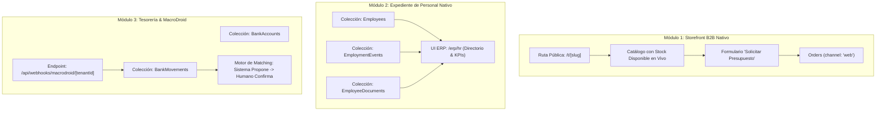

# Plan Detallado: Arquitectura Nativa de Módulos (Post-Wizard)
## Empresarial SaaS · Payload CMS 3.88 · Next.js 15 · Supabase

> **Fecha:** Septiembre 2026  
> **Estado:** APROBADO para Ejecución  
> **Decisión Arquitectónica Central (ADR):** Pivote de arquitectura hacia implementación 100% nativa de Payload CMS 3.x y Next.js 15 App Router. Se descarta la creación de nuevos plugins artificiales (`storefrontPlugin`, `hrPlugin`, `treasuryPlugin`), se elimina formalmente el `inboxPlugin` (Composio/Meta) y se descarta el `fiscalPlugin` complejo por riesgo regulatorio y penal.

---

## 1. Registro de Decisiones de Arquitectura (ADR)

### 1.1 ¿Por qué Implementación Nativa y Cero Plugins Nuevos?
En Payload CMS, los plugins (`Plugin = (config: Config) => Config`) tienen una única justificación técnica: **acoplar dos o más dominios preexistentes modificando colecciones cruzadas** (como `salesInventoryPlugin`, que descarga existencias del Kardex al emitir una `Invoice`, o `pricingPlugin`, que audita cambios de precio en `Products`).

Cuando se trata de módulos nuevos con sus propios dominios:
1. **Storefront B2B:** Es una superficie pública web en Next.js 15 App Router (`/t/[slug]`) que lee la base de datos vía Local API (`getPayload`) y genera pedidos (`Orders` con `channel: 'web'`). Envolver rutas de Next.js dentro de un plugin de Payload es un anti-patrón de arquitectura que dificulta el ruteo, el bundling y el streaming.
2. **Expediente de Personal (RRHH):** Son colecciones estándar (`Employees`, `EmploymentEvents`, `EmployeeDocuments`) que se benefician del registro directo y explícito en `src/collections/` y `payload.config.ts`.
3. **Peligro de Esquema con Plugins Condicionales:** Desactivar un plugin en tiempo de ejecución con `enabled: false` remueve las colecciones de la configuración, lo que provoca que el motor de migraciones de Drizzle/Postgres interprete las tablas como obsoletas y genere sentencias destructivas (`DROP TABLE`). Las colecciones nativas con control de acceso por roles o banderas en el inquilino son 100% estables y seguras.

### 1.2 Eliminación Formal del Módulo Inbox (WhatsApp / Instagram vía Composio)
- **Veredicto:** **CANCELADO Y ELIMINADO DEL ROADMAP.**
- **Fundamentación:**
  - La API Cloud oficial de Meta (WABA) impone verificaciones de empresa complejas, ventanas de soporte cerradas de 24 horas y aprobación manual previa de plantillas (HSM).
  - La dependencia de Composio añade fricción de OAuth por cliente, webhooks intermediados y costos operativos adicionales.
  - La descarga y alojamiento de notas de voz, imágenes y videos de clientes saturaría innecesariamente el almacenamiento de la plataforma.
  - **Alternativa Superior ya Operativa:** La suite nativa de enlaces públicos seguros (`/share/...`) combinada con los botones de deep-link directo a WhatsApp (`https://wa.me/...`) cubre la necesidad de comunicación comercial y cobranza con costo cero, sin riesgos de baneo de líneas y con cero mantenimiento de servidores.

### 1.3 Descarte del `fiscalPlugin` Complejo (SENIAT Pesado)
- **Veredicto:** **DESCARTADO POR RIESGO REGULATORIO Y LEGAL CRÍTICO.**
- **Fundamentación:**
  - En Venezuela, cualquier discrepancia en formatos de retención (TXT Forma 99035) o XML de ISLR acarrea multas tributarias severas o la clausura temporal del establecimiento comercial (de 5 a 10 días continuos) según el Código Orgánico Tributario.
  - La constante volatilidad de las providencias del SENIAT (como la reciente derogación de la PA 0121 por la PA 00084 en agosto de 2026) convierte el mantenimiento de un motor tributario en un lastre técnico.
  - Las impresoras fiscales físicas (The Factory HKA, Bixolon) requieren bridges locales incompatibles con una infraestructura serverless en la nube.
  - **Base Fiscal Ligera y Segura Preservada:** El ERP mantiene intacto su núcleo fiscal funcional:
    - Libro de Ventas en CSV normativo (con zona horaria de Caracas).
    - Desglose de IVA en 3 alícuotas (exento 0%, reducido 8%, general configurable 16%).
    - Percepción de IGTF (3%) informativo en cobros en divisas.
    - Modo Nota de Entrega por defecto (Sprint 41), que permite la operación comercial legal y ágil sin ataduras burocráticas innecesarias.

---

## 2. Especificación Técnica de los Módulos Nativos



---

### Módulo 1: Storefront B2B Nativo (Vitrina de Catálogo & Presupuesto)

#### 1.1 Modelo de Datos & Extensiones
- **Extensión en `src/collections/Tenants.ts`:**
  ```ts
  storefrontConfig: {
    enabled: boolean;
    brandName?: string;
    heroTitle?: string;
    heroSubtitle?: string;
    contactWhatsApp?: string;
    showPrices: boolean; // false para cotizaciones B2B donde el precio depende del volumen
  }
  ```
- **Extensión en `src/collections/Products/index.ts`:**
  - `storefrontVisible`: Campo booleano (default: `true`) para controlar qué artículos del inventario se muestran públicamente.
  - `imageUrls`: Array de textos para enlaces de imágenes de alta resolución validados.
- **Extensión en `src/collections/Orders/index.ts`:**
  - `channel`: Campo select (`erp`, `pos`, `web`), default: `erp`.

#### 1.2 Superficie Pública (Next.js 15 App Router)
- **Ruta:** `src/app/(app)/t/[slug]/page.tsx`
  - Server Component de carga instantánea consumiendo la Local API con `overrideAccess: true` filtrado por el inquilino correspondiente.
  - Diseño monocromo elegante con buscador en vivo y filtros por categoría.
  - Disponibilidad de stock en tiempo real calculada con `getProductWarehouseStock`.
- **Formulario "Solicitar Presupuesto":**
  - Carrito ligero en memoria (sin pasarelas de pago ni tarjetas).
  - Captura de datos de contacto: Razón Social / Nombre, Teléfono (WhatsApp), RIF/Cédula y Dirección de Entrega.
  - Protección de seguridad: Campo trampa (honeypot) para bots y limitación por IP.

#### 1.3 Acción del Servidor
- `requestStorefrontQuoteAction`:
  - Valida el payload con Zod.
  - Localiza o registra al cliente en el CRM con su teléfono.
  - Crea el documento en `Orders` con estado `draft` y `channel: 'web'`.
  - Dispara notificación opcional vía WhatsApp o correo al equipo comercial.

---

### Módulo 2: Expediente de Personal / RRHH Nativo

#### 2.1 Colecciones Canónicas
- **`Employees` (`src/collections/Employees/index.ts`):**
  - `tenant`: Aislamiento multi-tenant por fila.
  - `firstName`, `lastName`, `idNumber` (Cédula de Identidad con prefijo V/E/P), `taxId` (RIF personal).
  - `ivssNumber`: Número de seguro social obligatorio.
  - `hireDate`: Fecha de ingreso formal.
  - `jobTitle`: Cargo.
  - `department`: Departamento (Administración, Ventas, Almacén, Producción, etc.).
  - `contractType`: `fixed_term` | `indefinite` | `contractor`.
  - `salarySnapshot`: Información referencial de sueldo (`amountUSD`, `amountVES`, `frequency: monthly | biweekly`).
  - `bankDetails`: Banco, tipo de cuenta y número de 20 dígitos para transferencias.
  - `status`: `active` | `on_leave` | `vacation` | `inactive`.
  - `photo`: Relación opcional a colección `Media`.

- **`EmploymentEvents` (`src/collections/EmploymentEvents/index.ts`):**
  - Bitácora inmutable de eventos laborales.
  - `type`: `salary_increase` | `promotion` | `medical_leave` | `vacation` | `warning` | `bonus_delivery` | `note`.
  - `date`, `description`, `metadata` (jsonb con detalles como salario anterior vs nuevo).
  - `registeredBy`: Usuario que documentó el evento.

- **`EmployeeDocuments` (`src/collections/EmployeeDocuments/index.ts`):**
  - Repositorio digital de documentos (contratos firmados, copias de cédula, constancias médicas del IVSS, evaluaciones).

#### 2.2 Vistas de Usuario en el ERP
- **Ruta:** `src/app/(app)/[tenant]/erp/hr/page.tsx`
  - Directorio visual con tarjetas de empleados y buscador instantáneo.
  - KPIs rápidos: Total empleados activos, cumpleaños del mes, media de antigüedad.
  - Vista de detalle con historial cronológico de eventos y descarga de comprobantes.

---

### Módulo 3: Tesorería & Conciliación con MacroDroid Nativo

#### 3.1 Colecciones Canónicas
- **`BankAccounts` (`src/collections/BankAccounts/index.ts`):**
  - Cuentas de la empresa (Banesco, Mercantil, BDV, Bancamiga, Provincial, BNC, Zelle, Binance, etc.).
  - `currency`: `VES` o `USD`.
  - `accountNumber`, `accountType`.
  - `isActive`: booleano.

- **`BankMovements` (`src/collections/BankMovements/index.ts`):**
  - `account`: Relación a `BankAccounts`.
  - `date`, `amount`, `currency`, `reference` (número de confirmación bancaria).
  - `source`: `macrodroid` | `manual` | `import`.
  - `status`: `unmatched` | `proposed` | `matched` | `ignored`.
  - `idempotencyHash`: Cadena única indexada (`tenant_id + bank + reference + amount + date`) que bloquea duplicaciones en base de datos.
  - `matchedPayment`: Vínculo a `CustomerPayments` cuando se consolida.
  - `rawPayload`: jsonb con la notificación o SMS original capturado.

#### 3.2 Endpoint de Webhook para Dispositivos Móviles
- **Ruta:** `src/app/api/webhooks/macrodroid/[tenantId]/route.ts`
  - Autenticación por token fijo de dispositivo en cabecera `Authorization: Bearer <MACRODROID_KEY>`.
  - Procesa el POST estructurado que envía MacroDroid al recibir SMS o notificaciones push de los bancos venezolanos.
  - Inserción protegida contra duplicados.

#### 3.3 Motor de Conciliación Asistida ("El Sistema Propone, el Humano Confirma")
- El sistema cruza montos y referencias bancarias con las facturas abiertas del cliente.
- En la interfaz de Cajas o Cuentas por Cobrar se despliega la propuesta visual:
  *"Pago Móvil detectado por Bs 1.250 (Ref: 884920). Coincide con Factura #1089 de Inversiones Gómez. [Conciliar Pago]"*.
- Al pulsar el botón, se ejecuta `createPaymentAction` aplicando el cobro bajo el orden FIFO habitual.

---

## 3. Hoja de Ruta de Ejecución (Sprints)

| Sprint | Módulo | Entregables | Esfuerzo |
|---|---|---|---|
| **Sprint 46** | **Storefront B2B Nativo** | Campos en `Tenants`, `Products` y `Orders` + Ruta pública `/t/[slug]` + Server Action de presupuesto | 1.5 sprints |
| **Sprint 47** | **Expediente de Personal (RRHH)** | Colecciones `Employees`, `EmploymentEvents`, `EmployeeDocuments` + Pantalla `/erp/hr` + Directorio de personal | 1.5 sprints |
| **Sprint 48** | **Tesorería & Conciliación MacroDroid** | Colecciones `BankAccounts`, `BankMovements` + Route Handler Webhook + Motor de matching asistido | 2 sprints |

---

## 4. Auditoría de Riesgos y Reglas de Calidad
- **Aislamiento Multi-Tenant Estricto:** Toda consulta o mutación en las nuevas colecciones (`Employees`, `BankAccounts`, etc.) debe incluir el campo `tenant`.
- **Transaccionalidad en Mutaciones:** Las acciones de servidor deben ejecutarse dentro de `withTransaction` propagando `req`.
- **Tipado Fuerte:** Prohibido el uso de `any`; todos los componentes deben importar sus contratos desde `payload-types.ts`.
- **Validación con Zod:** Los formularios públicos del Storefront y el webhook de MacroDroid deben rechazar cualquier entrada que no satisfaga los esquemas de validación estricta.
