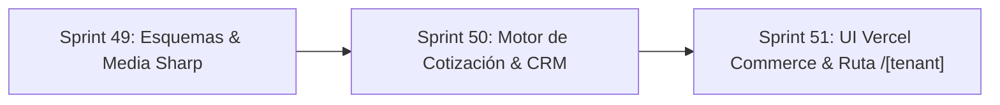

# Plan Multi-Sprint: Portal de Pedidos B2B (Vercel Commerce Style + Control Superadmin + Presupuestos ERP)

> **Superpower Activa:** `writing-plans` · **Skill de Dominio:** `payload` (v3.x / Next.js 15)  
> **Referencia de Arquitectura:** ERPNext B2B Requisition Model + Vercel Next.js Commerce Minimalist UI.

---

## Directivas Globales e Invariantes
1. **100% Framework-Native (Zero Hacks):** Uso estricto de APIs oficiales de Payload CMS 3.x (`upload.imageSizes`, `access.update` a nivel de campo, Local API con proyección, hooks de colección).
2. **Aislamiento Multi-Tenant:** Toda consulta y escritura está estrictamente particionada por `tenant`.
3. **Cero Manipulación de Precios:** Los precios cotizados se resuelven y congelan en el servidor desde la base de datos (anti-tampering).
4. **Seguridad de Base de Datos Local:** Puerto aislado `54322` (`/tmp/pg-local`). PROHIBIDO tocar puerto `5432` o `/tmp/mh-pg`.
5. **Next.js 15 Compliance:** Parámetros de rutas asíncronos (`const { tenant } = await params;`).

---

## Roadmap de Sprints

---

### SPRINT 49: Esquemas de Payload & Pipeline de Medios con Sharp
**Objetivo:** Adaptar las colecciones de Payload para soportar compresión automática WebP, visibilidad web de productos y control de activación exclusivo por Superadmin.

#### Tareas:
- [ ] **49.1 Configuración de Compresión Sharp en `Media`:**
  - Archivo: `src/collections/Media.ts`
  - Añadir `imageSizes` con Sharp para compresión nativa WebP:
    - `card`: 800x800, WebP, calidad 80 (para ficha y catálogo).
    - `thumbnail`: 400x400, WebP, calidad 80 (para drawer de carrito y vistas compactas).
  - Configurar `adminThumbnail: 'thumbnail'`.
  - Configurar `access.read: () => true` para permitir que visitantes del storefront carguen fotos de productos públicamente sin sesión de ERP.
- [ ] **49.2 Flag de Publicación en `Products`:**
  - Archivo: `src/collections/Products/index.ts`
  - Añadir campo `isPublishedOnWeb: { type: 'checkbox', defaultValue: true, index: true }`.
  - Permite a los operadores marcar qué productos se publican y cuáles quedan solo como insumos internos/BOM.
- [ ] **49.3 Configuración de Tienda con RBAC en `Tenants`:**
  - Archivo: `src/collections/Tenants.ts`
  - Añadir grupo `storefrontConfig`:
    - `enabled: { type: 'checkbox', defaultValue: false, access: { read: () => true, update: ({ req: { user } }) => Boolean(user?.role === 'super-admin') } }`.
    - `whatsappOrdersNumber: { type: 'text' }`.
    - `portalTitle: { type: 'text', defaultValue: 'Portal de Pedidos y Catálogo Mayorista' }`.
    - `portalDescription: { type: 'textarea' }`.
- [ ] **49.4 Sincronización de Tipos:**
  - Ejecutar `pnpm payload generate:types` para reflejar los nuevos tipos en `src/payload-types.ts`.
- [ ] **49.5 Pruebas Unitarias de Esquema:**
  - Crear `tests/unit/storefrontSchema.test.ts` validando las restricciones de acceso por rol para `storefrontConfig.enabled`.
- [ ] **49.6 Cierre de Sprint 49:** Validación `pnpm typecheck`, commit y PR.

---

### SPRINT 50: Motor de Cotización B2B & Vinculación con CRM
**Objetivo:** Desarrollar la Server Action segura de checkout que genera cotizaciones formales en el ERP, auto-crea clientes en el CRM y emite el enlace directo a WhatsApp.

#### Tareas:
- [ ] **50.1 Validación Zod de Entrada B2B:**
  - Archivo: `src/actions/storefrontActions.ts`
  - Esquema Zod para: `tenantSlug`, `companyName`, `taxId` (RIF), `phone` (WhatsApp), `email`, `notes`, y `items` (`productId`, `quantity`).
- [ ] **50.2 Verificación de Tenant Activo:**
  - Validar que el tenant existe y tiene `storefrontConfig.enabled === true`. Si no, rechazar la operación.
- [ ] **50.3 Cálculo Seguro de Precios (Anti-Tampering):**
  - Consultar en Postgres vía Payload Local API los precios oficiales `priceUSD` de cada producto.
  - Congelar la tasa de cambio oficial BCV del inquilino al momento de la orden.
- [ ] **50.4 Auto-Upsert de Cliente en CRM (`Customers`):**
  - Buscar si existe un cliente con ese `taxId` para el `tenantId`.
  - Si no existe: crearlo automáticamente como lead/cliente con `status: 'active'`.
- [ ] **50.5 Creación de Cotización Formal (`Quotes`):**
  - Asignar número correlativo oficial `COT-XXXXX` usando `nextDocumentNumber`.
  - Grabar la cotización en estado `draft` con la tasa congelada y desglose de líneas.
  - Generar el token criptográfico seguro mediante `ensureShareToken(payload, 'quotes', quoteId)`.
- [ ] **50.6 Generador de Mensaje y Link de WhatsApp:**
  - Construir URL `https://wa.me/${whatsappNumber}?text=...` con el desglose del pedido y enlace a `/share/quote/[token]`.
- [ ] **50.7 Pruebas Unitarias Transaccionales:**
  - Archivo: `tests/unit/storefrontQuote.test.ts` con cobertura de casos exitosos, validación de stock y rechazos por tienda inactiva.
- [ ] **50.8 Cierre de Sprint 50:** Validación `pnpm typecheck`, `pnpm test:unit`, commit y PR.

---

### SPRINT 51: UI Monocromática Vercel Commerce & Página Pública `/[tenant]`
**Objetivo:** Construir la interfaz de usuario en Next.js 15 inspirada en Vercel Next.js Commerce, con catálogo de alta velocidad, carrito deslizante y modal de pedido.

#### Tareas:
- [ ] **51.1 Tipos de Proyección Pública:**
  - Archivo: `src/components/storefront/types.ts`
  - Definición de `ProductProjection` (omitiendo costos, proveedores y fórmulas de manufactura).
- [ ] **51.2 Header Minimalista (`StorefrontHeader.tsx`):**
  - Barra fija superior con logo/nombre de la empresa, indicador de tasa BCV en vivo y botón del carrito con badge dinámico.
- [ ] **51.3 Tarjeta de Producto (`StorefrontProductCard.tsx`):**
  - Renderizado de imagen WebP optimizada desde la colección `Media` (con fallback SVG).
  - Título, SKU, stock disponible ("En Existencia" / "Bajo Pedido"), precio dual USD/VES y botón interactivo "Agregar al Pedido".
- [ ] **51.4 Drawer de Carrito (`StorefrontCartDrawer.tsx`):**
  - Panel deslizante lateral (*Sheet*) con lista de productos cotizados, modificación rápida de cantidades (+ / -) y total general estimado.
- [ ] **51.5 Modal de Pedido y Confirmación (`StorefrontCheckoutModal.tsx`):**
  - Formulario B2B: Razón Social, RIF, Teléfono WhatsApp, Notas.
  - Estado de éxito: número de cotización `COT-XXXXX`, botón verde prominente "Enviar Pedido a WhatsApp" y botón para ver la cotización oficial.
- [ ] **51.6 Catálogo con Búsqueda y Filtros (`StorefrontCatalog.tsx`):**
  - Filtro por categorías en píldoras horizontales y buscador en vivo sin recargas de página.
- [ ] **51.7 Página de Servidor en Next.js 15 (`src/app/(app)/[tenant]/page.tsx`):**
  - Extracción de `params` asíncrono (`const { tenant: tenantSlug } = await params`).
  - Consulta segura vía Local API con filtro `{ tenant, isActive: true, isPublishedOnWeb: true, productType: { in: ['standard', 'manufactured'] } }`.
  - Manejo de tienda no habilitada (`notFound()` o banner informativo sobrio).
- [ ] **51.8 Validación Integral de Extremo a Extremo:**
  - `pnpm typecheck`
  - `pnpm lint`
  - `pnpm test:unit`
- [ ] **51.9 Cierre de Sprint 51:** Commit, push único y Pull Request final.
